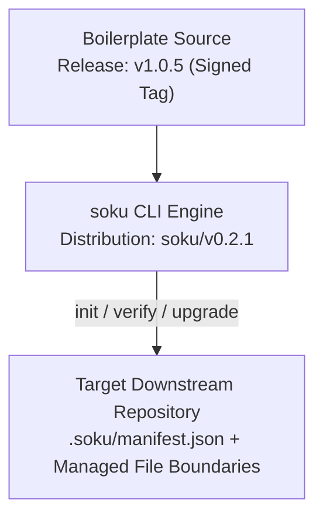

# 🧩 Soku-Convention-Boilerplate

> `soku` CLI を活用した宣言的なリポジトリ規約ベースラインおよびライフサイクルツールチェーンです。

[English](./README.md) | [한국어](./README.ko.md)

## 👋 概要

従来のプロジェクトボイラープレートは、複製直後から規約が乖離していく**テンプレートドリフト（Template Drift）**に陥りやすく、アップストリームの更新を手動で diff する際に人的エラーが発生します。

`Soku-Convention-Boilerplate` は、**Google Style Guide に沿ったベースライン**と **`soku` CLI ツールチェーン**を統合し、プロジェクトのライフサイクル全体を通じてリポジトリ規約を明示的、レビュー可能、かつ再現可能に管理します。

* **🎯 宣言的なコーディング規約:** マルチスタックプロファイル（TypeScript、Go、Python、Java）をサポートし、統一されたフォーマットと静的解析ルールを提供します。
* **🛡️ 管理所有権モデル（Managed Ownership）:** Soku は管理対象ファイルの所有権とベースラインを `.soku/manifest.json` に記録し、プロジェクト固有のコードは自動ライフサイクル変更の対象外として保護します。
* **🔁 再現可能な CLI ワークフロー:** 明示的な不変入力、dry-run による計画の事前検証、およびトランザクション型の安全なアップグレードを提供します。

## 🗺️ マスターブループリントおよび運用規約

* **標準アーキテクチャ設計:** [BLUEPRINT.md](./BLUEPRINT.md)（設計権威ドキュメント）
* **ライフサイクルおよび所有権契約:** [SOKU_LIFECYCLE.md](./docs/standards/SOKU_LIFECYCLE.md)（規範的 ADR）
* **導入手順および利用マニュアル:** [USAGE_MANUAL.md](./docs/guides/USAGE_MANUAL.md)（全体利用ガイド）
* **完全検証スイート:** [VERIFICATION_GUIDE.md](./VERIFICATION_GUIDE.md)（ローカル、ホスティング、リリース検証）

## ⚡ 60秒クイックスタート

### 1) `soku` CLI のインストール

```bash
npm install -g @soku-jinseok/soku@0.2.1
```

*（または `soku/v0.2.1` リリースページからスタンドアロンバイナリを取得し、`checksums.txt` で検証してインストール）*

### 2) 初期化計画の事前プレビュー（`--dry-run`）

```bash
soku init \
  --boilerplate-source https://github.com/Soku-JINSEOK/Soku-Convention-Boilerplate \
  --boilerplate-release v1.0.5 \
  --profile standard \
  --stack javascript-typescript-node \
  --project-name my-service \
  --verify \
  --dry-run
```

### 3) 同一の入力値で確定適用（`--yes`）

```bash
soku init \
  --boilerplate-source https://github.com/Soku-JINSEOK/Soku-Convention-Boilerplate \
  --boilerplate-release v1.0.5 \
  --profile standard \
  --stack javascript-typescript-node \
  --project-name my-service \
  --verify \
  --yes
```

### 4) 標準検証の実行

初期化された対象プロジェクト（例: Node.js / TypeScript スタック）:

```bash
npm run format:check && npm run lint && npm run test && npm run build
```

当ボイラープレートリポジトリ自体の完全検証スイートの実行:

```bash
./scripts/verify.sh
```

## 🏗️ アーキテクチャおよびライフサイクルフロー



## 📦 現在公開中のベースライン

現在公開中のリリースは、2つの独立したリリース軸で運用されています:

* **ボイラープレートベースライン:** `v1.0.5`（署名付きタグ）
* **CLI ディストリビューション:** `soku/v0.2.1`（スタンドアロンバイナリおよび npm パッケージ）

署名済み `v1.0.5` 修正リリースは、immutable `v1.0.4` の公開マイグレーション smoke で確認された境界を修正し、ライフサイクル管理下の `.soku/` 状態を JavaScript および TypeScript フォーマットの対象外にします。既存のタグは不変のまま維持され、現在のボイラープレートベースラインとして `v1.0.5` を使用してください。完全な検証手順については [VERIFICATION_GUIDE.md](./VERIFICATION_GUIDE.md) を参照してください。

---

## 📌 一目で見る

| 領域 | 標準 |
| --- | --- |
| スタイルベースライン | `Google Style Guide` |
| 人間向けのドキュメント | 英語、韓国語、日本語を基本サポート |
| ルールおよびガバナンスドキュメント | 英語のみ提供 |
| コア目標 | 複数プロジェクト間の一貫性の維持 |
| コードレビューの最優先事項 | 論理、明確さ、保守性 |
| ルール強制メカニズム | フォーマッター + リンター + ドキュメント自動検証 |
| コミットスタイル | Gitmoji + Conventional Commits |
| リリースタグ | Verified ステータスのための署名付きタグ (`git tag -s`) |

## 🤔 Google Style Guideを採用する理由

このプロジェクトは、基本的なスタイルガイドとして `Google Style Guide` を採用しています。  
第一の理由は、コードは書かれる回数よりも読まれる回数の方がはるかに多いという哲学に深く共感しているためです。私たちは、短期的な実装スピードよりも、長期的な明確さと保守性に高い価値を置いています。

第二の理由は、自動化の容易さです。Googleスタイルのコーディング規約は、フォーマッター、リンター、静的分析ツールとスムーズに連携するため、主観的なスタイルに関する議論を最小限に抑え、チームがビジネスロジックやアーキテクチャにより集中できる環境を提供します。

---

## 💭 哲学

このボイラープレートは、プロジェクトの規模、年数、作業者に関わらず、コードベースが一貫して理解可能で予測可能でなければならないという信念に基づいています。

私たちはコードスタイルを単なる見た目の好みとして扱いません。スタイル規約は、曖昧さを排除し、コラボレーションを強化し、同じコードベースで働く人間とAIエージェント双方の作業効率を向上させるための最小限の運用の安全装置です。

私たちの目標は、新しいドメインでプロジェクトを開始するたびにチームの文化を一から作り直すことなく、再利用可能な堅牢な基盤の上で迅速にスタートできるようにすることです。

## ✅ 原則

1. 読みやすいコードは、巧妙なコードよりも優れています。
2. 一貫性は、個人のコーディングの好みよりもはるかに価値があります。
3. 自動化ツールでスタイルを規定できる場合は、必ずそうするべきです。
4. プロジェクトの構造は、複数のリポジトリにわたって予測可能であるべきです。
5. コードレビューは、フォーマットに関する議論ではなく、論理、振る舞い、設計に力を注ぐべきです。
6. ドキュメントは、単に動作を説明するだけでなく、作成者の意図（Intent）を説明する必要があります。
7. すべての規約は、現在の貢献者だけでなく、未来の保守者にも役立つものでなければなりません。

## ⚙️ 運用標準

### 1. スタイルベースライン

このボイラープレートに基づいて作成されるすべてのリポジトリは、明確な例外理由が明文化されていない限り、`Google Style Guide` を標準のスタイルベースラインとします。

### 2. フォーマットおよびリンティング

コードのフォーマットとリンティングは義務的に自動化され、ローカル開発およびビルドプロセスの必須ワークフローとして扱われなければなりません。ツールでルールを検証できる場合は、手動で指摘する代わりに自動リンターを通じて事前にはじく必要があります。

### 3. リポジトリの一貫性

リポジトリ間のディレクトリ構造、命名規則、ドキュメント配置パターンを標準化することで、開発者が他のリポジトリに切り替えて作業する際に発生する認知的コスト（Cognitive Overhead）を最小限に抑えます。

### 4. ドキュメント作成規則

ドキュメント作成言語は、[BLUEPRINT.mdのLanguage Policy](./BLUEPRINT.md#language-policy)に従います。ユーザー向けの概要ドキュメントは英語、韓国語、日本語を基本サポートしますが、ルール、ポリシー、技術ガイドライン、およびAI指示書は英語のみで記述します。

### 5. レビュー規律

プルリクエストとコードレビューは、以下の事項を最優先に扱います：

* 動作の正しさ (Correctness)
* 保守性 (Maintainability)
* アーキテクチャ的な明確さ (Architectural clarity)
* テスト容易性 (Testability)
* 意思決定のトレードオフ

書式や改行などのスタイルに関する論点は、自動化されたリンター/フォーマッターツールに完全に委ねます。

### 6. 規約の汎用性

このボイラープレートに追加されるすべてのルールは、様々なリポジトリで複製して再利用できる汎用性を備えていなければなりません。特定のプロジェクトにのみ有効なルールは、このボイラープレートではなく、該当プロジェクト内部の開発ドキュメントに記述されるべきです。

### 7. AIエージェントとの親和性

このリポジトリは、AIエージェントが以下の事項を直感的に把握できるように最適化されている必要があります：

* プロジェクトの本来の意図およびアーキテクチャの目的
* コード所有権の境界線
* 構造的な規約および命名規則
* ドキュメント作成基準
* ビルド、テスト、および検証ワークフロー

これを実現するため、グローバルなルールと方針は、直接的で明快な英語で一貫して記述されます。

## 🎯 期待される効果と用途

このボイラープレートは、以下の役割を果たすために存在します：

* 新しいリポジトリを開始する際の標準スケルトン（スターティングポイント）
* 個人およびチームプロジェクト全体に適用される一貫した規約共有レイヤー
* 可読性が高く、読みやすい堅牢なコードを書くためのトレーニング場
* 自動化を通じて書式に関する摩擦を排除する快適な開発環境
* 人間の開発者とAIエージェントが共に理解し合える安定したリポジトリ構造の構築

## 📚 関連ドキュメント一覧

* [README.md](./README.md): 多言語概要およびプロジェクトポジショニング
* [BLUEPRINT.md](./BLUEPRINT.md): 公式リポジトリ設計図および権限マップドキュメント
* [CONTRIBUTING.md](./CONTRIBUTING.md): コントリビューションの流れとコミットメッセージルール
* [AGENTS.md](./AGENTS.md): AIエージェント動作ガイド（英語専用）
* [LICENSE](./LICENSE): ボイラープレート基本ライセンスドキュメント（MIT）
* [SECURITY.md](./SECURITY.md): セキュリティ欠陥の報告窓口
* [`soku` CLI](./soku/README.md): ビルド、インストール、検証、パッケージ、およびリリース運用
* [Soku ターミナルおよび completion ガイド](./docs/guides/SOKU_TERMINAL_GUIDE.ja.md): 色、日常フロー、自動化、4 shell の設定
* [VERIFICATION_GUIDE.md](./VERIFICATION_GUIDE.md): ローカル、hosted、governance、artifact、security、cost の完全な検証

### 📏 `docs/standards/` — 構造とプロセスの規範ドキュメント

* [CODE_STYLE.md](./docs/standards/CODE_STYLE.md): コードスタイルのベースラインと作成ルール
* [PROJECT_STRUCTURE.md](./docs/standards/PROJECT_STRUCTURE.md): リポジトリフォルダ構成および構造ルール
* [GITHUB_STANDARDS.md](./docs/standards/GITHUB_STANDARDS.md): イシュー、PR、レビュー、およびテンプレート運用基準
* [RELEASE_AND_SYNC.md](./docs/standards/RELEASE_AND_SYNC.md): リリースタグ配備と同期手順
* [SOKU_LIFECYCLE.md](./docs/standards/SOKU_LIFECYCLE.md): `soku` CLI、マニフェスト、所有権、プロバイダ、およびトランザクションライフサイクルの規範
* [REAL_RUNTIME_MANUAL_CAPTURE.md](./docs/standards/REAL_RUNTIME_MANUAL_CAPTURE.md): local/manual の実 frontend capture、provenance、adapter、map provider の境界
* [CICD_STANDARDS.md](./docs/standards/CICD_STANDARDS.md): 継続的インテグレーションおよびデリバリー（CI/CD）の運用基準

### 🛡️ `docs/policy/` — 領域別基本ポリシー宣言書

* [LICENSE_POLICY.md](./docs/policy/LICENSE_POLICY.md): ライセンス選択ガイドライン
* [SECURITY_POLICY.md](./docs/policy/SECURITY_POLICY.md): ソース、機密情報（Secret）、配備段階別のセキュリティ基本方針
* [CLOUD_POLICY.md](./docs/policy/CLOUD_POLICY.md): クラウドプロバイダ（GCP, AWS, Azure）の選定ルール

### 🧭 `docs/guides/` — ベストプラクティスおよび案内ガイドドキュメント

* [USAGE_MANUAL.md](./docs/guides/USAGE_MANUAL.md): 適用レベルと検証済み installation から governance、任意の GCP dev deploy、upgrade までをつなぐ人間向け開始点
* [STACK_EXAMPLES.md](./docs/guides/STACK_EXAMPLES.md): 主要言語、DB、クラウドワークフローの構築例
* [STACK_CONFIGS.md](./docs/guides/STACK_CONFIGS.md): スタック別設定ファイルテンプレート一覧
* [README_GUIDE.md](./docs/guides/README_GUIDE.md): プロジェクトのREADMEを明確に維持するためのガイド
* [INIT_GUIDE.md](./docs/guides/INIT_GUIDE.md): 下流リポジトリをセットアップする際にAIが参照するチェックリスト
* [APPLICABILITY.md](./docs/guides/APPLICABILITY.md): 個人開発とチーム開発における適用規約の分類基準
* [LANGUAGE_SELECTION.md](./docs/guides/LANGUAGE_SELECTION.md): 新しいプロジェクトや機能に使用するプログラミング言語を選ぶための基準

### 📝 `docs/issues/` — タスクレポート成果物

* [TASK_REPORT_TEMPLATE.md](./docs/issues/TASK_REPORT_TEMPLATE.md): 実装着手前に文書化・承認を得るための計画テンプレート

## 🧱 スタータースタック対応範囲

このボイラープレートは、様々な技術スタックに対応できるよう、継続的に拡張可能な状態を維持します。基本ガイドは以下をカバーします：

* `JavaScript` / `TypeScript` / `Node.js`
* `Python`
* `Go`
* `Java` / `Spring`
* `MySQL` / `PostgreSQL`
* `gcloud` / `AWS` / `Azure`

## 🛠️ 設定テンプレートセット

開発環境設定ファイル（`package.json`、`pyproject.toml`、`Makefile` など）については、[STACK_CONFIGS.md](./docs/guides/STACK_CONFIGS.md) および `templates/` ディレクトリを参照してください。

## 🎬 要約

このボイラープレートは、単なるプロジェクトのスターティングポイントを超えて、複数のプロジェクトにわたりチームの開発基準とコードの価値を一貫して維持するための、信頼性の高い再利用可能な運用の基盤です。
