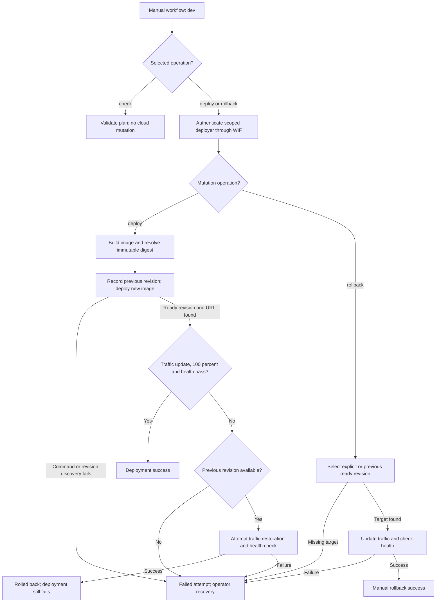

# Cloud Run CI/CD and bootstrap guide

> **Document purpose:** Deployment runbook. Explains GCP bootstrap, manual dev deployment, authenticated health checks and rollback.
>
> **Key point:** Validation is separate from delivery; follow the explicit operation and environment boundaries.

## Manual dev delivery



**How to read:** This is the implemented manual dev path in
[deploy-gcp.yml](../../.github/workflows/deploy-gcp.yml) and
[cd-deploy.sh](../../scripts/cd-deploy.sh). Both mutation operations authenticate.
Automatic rollback is conditional, and successful rollback still reports the
deployment as failed. Image/build/authentication failures can stop the workflow
before the deploy helper starts; its attempt artifact is not proof those stages
completed. This diagram does not assert any current live cloud state.

**Reader check:** Confirm the environment, digest, scoped identity, observed traffic and health, available recovery target, and the sanitized attempt result.

This deployment path is manual by design. Local defaults and ordinary CI perform
only syntax, formatting, validation, and mock regression checks. They never apply
Terraform, push images, call GCP APIs, or deploy Cloud Run.

Cloud Build validation is a separate opt-in path. It validates GCP-specific
configuration but never publishes an image or deploys Cloud Run. Production
delivery authority remains exclusively in the manual GitHub Actions workflow.

## Required repository variables

The bootstrap command registers exactly these GitHub Repository Variables:

| Variable | Value |
| --- | --- |
| `GCP_PROJECT_ID` | Supplied project ID |
| `GCP_REGION` | Region, default `asia-northeast1` |
| `GCP_SERVICE_NAME` | Service, default `soku-convention-boilerplate` |
| `GCP_ARTIFACT_REPOSITORY` | Repository, default `cloud-run` |
| `GCP_WIF_PROVIDER` | Full Terraform WIF provider resource name |
| `GCP_WIF_SERVICE_ACCOUNT` | Terraform deployer service-account email |

OIDC/WIF requires no long-lived service-account JSON secret. Its trust condition
requires the immutable GitHub repository and owner IDs, the `main` ref, and the
exact `.github/workflows/deploy-gcp.yml` workflow on `main`.

## From project ID to first infrastructure

Authenticate locally with an identity allowed to enable APIs and create GCS,
Artifact Registry, IAM, WIF, and Cloud Run resources. Put the project ID in the
CLI environment and preview first:

```bash
export GCP_PROJECT_ID="<GCP_PROJECT_ID>"
scripts/gcp-bootstrap.sh
```

The preview validates defaults and prints commands without invoking `gcloud`,
`docker`, `terraform`, or `gh`. `GCP_REGION`, `GCP_SERVICE_NAME`, and
`GCP_ARTIFACT_REPOSITORY` may also override their documented defaults. A command
line `--project-id` takes precedence over `GCP_PROJECT_ID`.

Apply only after reviewing and explicitly repeating the exact project ID:

```bash
scripts/gcp-bootstrap.sh \
  --apply \
  --confirm-project-id "$GCP_PROJECT_ID"
```

The apply sequence is:

1. Create `gs://<GCP_PROJECT_ID>-tfstate` if it does not exist, then enforce
   uniform bucket-level access, public access prevention, object versioning,
   and removal of legacy project Viewer read bindings.
2. Resolve immutable GitHub repository and owner IDs and initialize the partial
   GCS backend with prefix `cloud-run`.
3. Apply only the explicit foundation Terraform targets with
   `deploy_runtime=false`; no image is needed and an existing runtime is not
   destroyed on a repeated bootstrap.
4. Build and push the bootstrap image, then resolve its immutable digest.
5. Apply runtime Terraform with `deploy_runtime=true` and the digest URI.
6. Upsert the six repository variables with `gh variable set`.

Bucket lookup/creation, protection updates, legacy Viewer cleanup, and variable
writes are safe to repeat. Terraform uses the same remote state for both stages;
state and project-specific tfvars are never committed.

## Optional Cloud Build validation

The GCP project must already have its first-generation Cloud Build GitHub App
connection for this repository. Preview the additional API, dedicated service
account, Logs Writer binding, and two triggers:

```bash
scripts/gcp-bootstrap.sh \
  --enable-cloud-build-validation
```

Apply only after reviewing the preview and repeating the project ID:

```bash
scripts/gcp-bootstrap.sh \
  --enable-cloud-build-validation \
  --apply \
  --confirm-project-id "$GCP_PROJECT_ID"
```

Trigger creation fails if the existing first-generation connection is
unavailable. The bootstrap does not create or migrate to a second-generation
connection. Keep the enable flag on subsequent bootstrap applies; the Terraform
variable defaults to `false`, which is also the rollback setting.

The enable flag uses a validation-only apply path. It exits after the targeted
API, identity, IAM, and trigger resources succeed, before Docker authentication,
image build or push, runtime Terraform, and GitHub repository-variable writes.
This makes the integration apply safe to compare against an unchanged Cloud Run
revision.

The validation-only path stores state under the isolated
`cloud-build-validation` GCS prefix. Existing foundation, runtime, and deployment
plans keep using `cloud-run`, so their default `false` value cannot remove the
validation triggers.

The PR trigger, `soku-convention-boilerplate-pr`, validates pull requests whose
target is `main`. External contributors require a repository writer to comment
`/gcbrun`. The `soku-convention-boilerplate-main` trigger validates pushes to
`main`. Both use a dedicated service account with only
`roles/logging.logWriter`, Cloud Logging-only output, and
`cloudbuild/validation.yaml`.

The build runs the existing GCP deployment regression tests and the Cloud Build
policy tests under Node 24, checks Terraform formatting and validity, executes
Terraform mock plans, and builds `templates/gcloud` for `linux/amd64`. It does
not push the resulting image, write to Artifact Registry, access secrets, or run
a deployment command.

Cloud Build does not replace the repository's existing pull-request policy.
Before opening the validation PR, use the repository template, add one `type:*`
and one `area:*` label, assign an owner, and keep a Draft linked with
`Related to #N`. An immediate `PR Metadata Gate` failure that is replaced by a
successful metadata-event run on the same head commit is a metadata violation,
not a GCP incident. Classify it as a CI defect only when the current,
metadata-complete head commit still fails. Cancelled duplicate runs are not
Cloud Build failures.

Treat both checks as informational at first. With a controlled PR and its merged
`main` commit, verify the repository and commit SHA, all build steps, the
dedicated service account, successful status, and GitHub log links. Also compare
Artifact Registry images and Cloud Run revision, image digest, and traffic
before and after, then confirm the authenticated `/health` response remains
`ok`.

After both builds have successful evidence, add only the exact PR check context
shown by GitHub to `main` branch protection. Do not make the main push trigger a
required check. Verify the required flow again with an external pull request and
writer-issued `/gcbrun` approval.

Rollback is an apply with `enable_cloud_build_validation=false`. It removes only
the validation triggers, dedicated identity, and IAM binding. It preserves the
enabled API, GitHub App connection, GitHub Actions deployer, Artifact Registry,
and Cloud Run.

## First dev deployment

Open **Actions → Deploy to GCP (Cloud Run) → Run workflow**. Select
`operation=check` first; it is the default and has no OIDC permission or cloud
commands. Then select `operation=deploy` and `environment=dev`. Only deploy and
rollback jobs receive `id-token: write` and authenticate to GCP.

The deployment builds and pushes a commit-tagged image, resolves the immutable
digest, deploys it, checks `/health`, and stores evidence. Only `dev` is exposed
by this workflow. Staging and production stay unavailable until separate GitHub
Environments, approval rules, environment-scoped variables, and isolated GCP
runtime targets are configured and reviewed.

The deployer has project-level Cloud Run administration because service creation
requires it, but Artifact Registry write access is limited to the configured
repository and `iam.serviceAccountUser` is limited to the dedicated runtime
service account. It has no project-level Token Creator role. The deployer can
mint an ID token only for itself and has service-scoped Cloud Run Invoker access,
which lets the deployment script authenticate its private `/health` request.
The workflow passes that service-account email explicitly to `cd-deploy.sh`,
which mints an audience-bound ID token through service-account impersonation.
Local callers may omit `--identity-service-account`; the helper then keeps the
active-account token path for backward compatibility. Never enable shell tracing
around this command or persist identity tokens or generated credential paths.

The deploy helper records handled deployment and rollback outcomes under the
non-hidden `deploy-evidence/` directory. Earlier authentication, build or plan
failures can leave no helper record. The workflow uploads that directory even
when the operation fails and treats a missing evidence file as an operation
failure. Inspect `final_status`, `environment`, `commit`, `error`,
`verified_traffic_percent`, `run_id`, `run_attempt` and `timestamp` in the JSON.
The public record deliberately excludes revision names, rollback targets,
service URLs, tokens and credential paths. Correlate the run ID with Actions;
inspect revision state through the authorized operator's cloud access.
The deploy helper also assigns 100% traffic to the resolved ready revision and
verifies Cloud Run's reported percentage before calling `/health`. A missing or
non-100% value fails the deployment and attempts restoration only when a
pre-deploy revision exists. Restoration can itself fail.
Successful evidence records `verified_traffic_percent: 100`.

## Recovery

Run the same workflow with `operation=rollback`. Optionally supply an exact
`rollback_revision`; otherwise the deployment helper selects the previous ready
revision. Traffic-update, traffic-percentage or post-deploy health failures
attempt restoration to the recorded pre-deploy revision when one exists.
A failed deploy command or missing revision/URL exits without that automatic
rollback. Recovery changes application traffic; it does not undo data changes.

| Helper outcome | Exit | Operator interpretation |
| --- | --- | --- |
| Deployment succeeds | 0 | New revision passed traffic and health checks |
| Automatic restoration and health succeed | 1 | Deployment failed; recovery succeeded |
| Deploy/discovery failure or unsuccessful automatic recovery | 9 | Inspect cloud state and recover explicitly |
| Manual rollback target missing | 4 | Supply or establish a valid target |
| Manual rollback traffic/health fails | 9 | Recovery is incomplete |
| Manual rollback succeeds | 0 | Requested restoration passed health |

**Why preserve failure after recovery:** Restoring availability does not make
the attempted change acceptable. Keeping a failing result prevents a recovered
incident from being mistaken for a successful delivery.

Local emergency rollback is also available after generating a rollback plan:

```bash
scripts/cd-plan.sh --environment dev --project-id "$GCP_PROJECT_ID" \
  --region "$GCP_REGION" --service-name "$GCP_SERVICE_NAME" \
  --artifact-repository "$GCP_ARTIFACT_REPOSITORY" --rollback-only

scripts/cd-deploy.sh --plan-file <PLAN_FILE> --rollback-only \
  --rollback-revision <REVISION> --confirm
```
