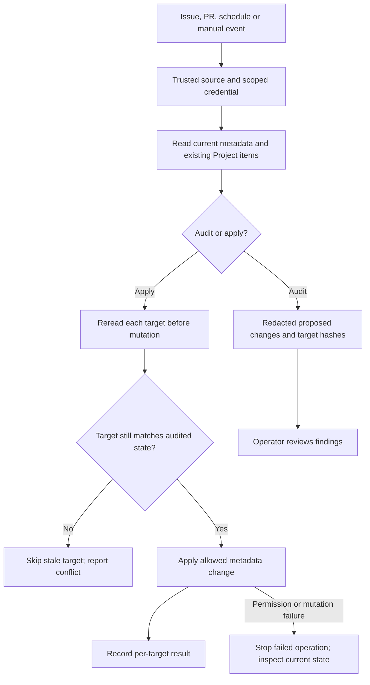
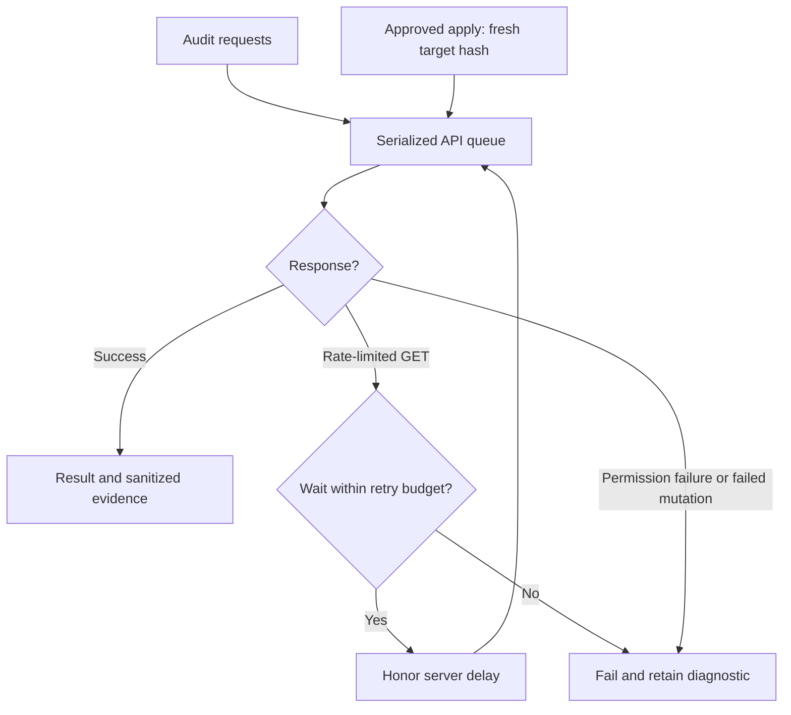

# GitHub Project and Metadata Synchronization

> **Document purpose:** Metadata synchronization guide. Explains installation, audit, guarded apply and recovery for Issue and Project metadata synchronization.
>
> **Key point:** Use the scoped identity and fresh target state; source-code mutation and duplicate Project items are outside its scope.

## Metadata audit and apply



**How to read:** Audit describes intended metadata changes. Apply rereads each target so concurrent edits are not overwritten. Requests use the serialized queue and rate-limit rules in the dedicated section below.

**Reader check:** Check the event's credential context, repository scope, target freshness and unresolved per-target findings.

This repository synchronizes GitHub Issue and pull request metadata with the
user-owned Project #2. The synchronization scope is deliberately narrow:

- `Soku-JINSEOK/Soku-Convention-Boilerplate` only;
- existing Project items only; and
- labels, Issue relations, and Project field values only.

The synchronizer never adds a pull request as a duplicate Project item, changes
an Issue or pull request title, changes commits or reviews, reopens or closes
work, or replaces custom labels. It reads bodies in memory to derive metadata,
but reports store body hashes and never store body text.

## Install the optional Soku component downstream

The Soku CLI can install the reviewed automation into another initialized
repository without copying this boilerplate repository's configuration. Plain
`soku init` remains unchanged:

```bash
soku init --project-sync --project-sync-project-number 2 --dry-run
soku init --project-sync --project-sync-project-number 2 --yes
```

For a fresh repository, add the option to the normal boilerplate selection
flags. For an initialized repository, the second command installs only the
Project Sync component. Non-interactive use requires a positive Project number;
interactive use can provide it at the prompt. Repeated installation is a
no-op. Existing repository-specific Project Sync files cause a collision and
are not adopted.

The generated files are portable: the workflow passes `GITHUB_REPOSITORY` at
runtime, the configuration uses `owner: "@me"` and the selected Project number,
and no historical Issue/PR mappings, credentials, secrets, or raw bodies are
copied. `.github/project-sync.yml` is project-owned after installation so its
Project-specific customization is preserved; the workflow, runtime, and test
asset remain component-managed. The manifest migrates from v1 to v2 and
`status`, `diff`, and `upgrade` retain the component record.

After installation, setup is manual: create or select the user-owned Project,
add the dedicated `PROJECT_SYNC_TOKEN` Actions secret with only Metadata read,
Issues read/write, Pull Requests read/write, and authenticated-user Projects
read/write permission, then set `PROJECT_SYNC_ENABLED=true`. Run an audit first
and review the redacted report before selecting apply mode with
`PROJECT_SYNC_MODE=apply` or manual dispatch. The CLI itself performs no
GitHub API calls and creates no GitHub credentials, Projects, or cloud
resources. Organization-owned Projects are outside v1.

## Local commands

Use Node.js 24 or later and an authenticated GitHub token with the permissions
described below. The default mode is an audit and does not mutate GitHub:

```bash
node scripts/github-project-sync.mjs \
  --mode audit \
  --repo Soku-JINSEOK/Soku-Convention-Boilerplate \
  --project-owner @me \
  --project-number 2 \
  --output /tmp/project-sync-audit.json
```

Apply only an approved report with a fresh read for every operation:

```bash
node scripts/github-project-sync.mjs \
  --mode apply \
  --repo Soku-JINSEOK/Soku-Convention-Boilerplate \
  --project-owner @me \
  --project-number 2 \
  --output /tmp/project-sync-apply.json
```

`--issue-number N` and `--pr-number N` limit a run to one target. The apply
mode compares the current target hash with the audit hash immediately before
each mutation. A changed hash is reported as `stale-read` and that target is
skipped; other independent targets continue.

## Backfill manifest

`.github/project-sync.yml` is JSON-compatible YAML so it can be validated
without an unpinned runtime dependency. It records the approved historical
relations and the title, labels, and assignee for the August 2026 dependency
tracking Issue. It does not contain Issue or pull request bodies.

The initial backfill maps PRs `#89`, `#90`, `#142`, `#144`, and `#145` to Issue
`#69`. PRs `#182` and `#183` use the monthly dependency tracking Issue. If that
Issue does not exist, apply mode creates it once and uses the returned Issue
number for both relations. An existing Issue with the configured title wins;
the tool never creates a second copy.

The merged-pull-request pass adds `status:done` and removes active status
labels. The Issue pass maps completed Issues to `status:done` and normalizes
open Issues using `Blocked`, `In progress`, `Ready`, then `Inbox` precedence.
Closed Issues whose close reason is `not_planned` or `duplicate` remain an audit
warning and are never presented as `Done` automatically.

## Project field rules

For existing Project items belonging to this repository, the synchronizer
uses the following precedence:

- `Status`: close reason first; otherwise the canonical status label priority.
- `Priority`: `priority:` label, explicit body value, then `P2`.
- `Size`: explicit `Size:` or `Estimate:` body value, then fixed buckets based
  on linked pull requests, changed files, and Scope list items.
- `Workstream`: explicit body value, then `security`, `release`/`publication`/
  `deploy`, `governance`/`audit`/`policy`, then `Engineering`.
- `Target date`: only an explicit `YYYY-MM-DD` value in the body; no date is
  invented and an existing date is preserved when none is specified.

The size buckets are `XS` for 0 PRs, at most 2 files, and at most 1 Scope item;
`S` for at most 1 PR, 8 files, and 3 Scope items; `M` for at most 2 PRs, 20
files, and 6 Scope items; `L` for at most 4 PRs, 50 files, and 12 Scope items;
and `XL` otherwise. An explicit size always wins.

## Workflow operation

`.github/workflows/project-sync.yml` runs on Issue creation, edits, labels,
reopen, and close events; pull request creation, synchronization, edits, and
close/merge events; a daily schedule; and manual dispatch. Repository events
run in apply mode. Manual dispatch defaults to audit and offers an explicit
apply choice. Pull request events from forks are excluded from mutation jobs.

The workflow checks out the trusted base revision and does not execute code
from a pull request head. It grants no `contents: write` permission. The
`PROJECT_SYNC_TOKEN` secret is passed as `GH_TOKEN`; it must be configured
before scheduled or event-driven apply runs.

For future Dependabot pull requests, set the repository variable
`DEPENDENCY_TRACKING_ISSUE` to the monthly tracking Issue number. If a
Dependabot PR has no relation and the variable is missing, the workflow fails
closed with an audit finding instead of guessing or creating an unrelated
Issue.

## Request scheduling and rate-limit recovery

The API client serializes requests so audit pagination cannot create an
unbounded burst. A rate-limited GET can retry at most twice. It waits at least
60 seconds, then 120 seconds, and also honors a later `Retry-After` or primary
rate-limit reset time. If the requested wait exceeds the 120-second per-retry
budget, the run fails instead of retrying early. Queued and later requests
remain blocked until that cooldown expires; they do not bypass the limit.

Ordinary authentication/permission failures fail immediately. Mutations,
including GraphQL POSTs, are never automatically replayed. An exhausted retry
budget remains a failed run. Inspect the log and credential configuration
before a deliberate rerun. The repository and distributed Soku runtime share
this behavior.



- [ ] Configure the documented credential in the event's actual secret context.
- [ ] Link a Dependabot PR to its existing tracking Issue; do not guess the relation.
- [ ] Treat exhausted limits, denied access and skipped work as unresolved.
- [ ] After a failed mutation, reread current state before any manual retry.

This follows [GitHub's API rate-limit guidance](https://docs.github.com/en/rest/using-the-rest-api/best-practices-for-using-the-rest-api#handle-rate-limit-errors-appropriately).

## Token setup and rotation

The authoritative operational procedure is the
[Project Sync credential setup and rotation runbook](./PROJECT_SYNC_CREDENTIAL_RUNBOOK.md).
It separates replacement audit, secret replacement, post-replacement audit,
optional approved apply, and old-credential revocation so no successful read is
mistaken for approval to perform the next mutation.

Use a dedicated fine-grained token or GitHub App credential owned by the
repository maintainer. Grant only:

- repository Metadata: read;
- repository Issues: read and write;
- repository Pull requests: read and write; and
- the authenticated user's Projects permission: read and write.

Do not grant repository Contents write, Actions administration, releases,
workflow edits, or organization administration. Store the token as the
repository Actions secret `PROJECT_SYNC_TOKEN`, not in a file or repository
variable.

To rotate it:

1. Create the replacement credential with the same narrow permissions.
2. Run an audit using the replacement credential and inspect the redacted
   report.
3. Replace `PROJECT_SYNC_TOKEN` in repository Actions secrets.
4. Run a manual dry-run/audit, then an explicitly approved apply if needed.
5. Revoke the old credential and record the rotation date in the repository's
   secret inventory.

A token failure is an operational failure. Do not weaken the workflow
permissions or fall back to a broad personal token to make a run green.
