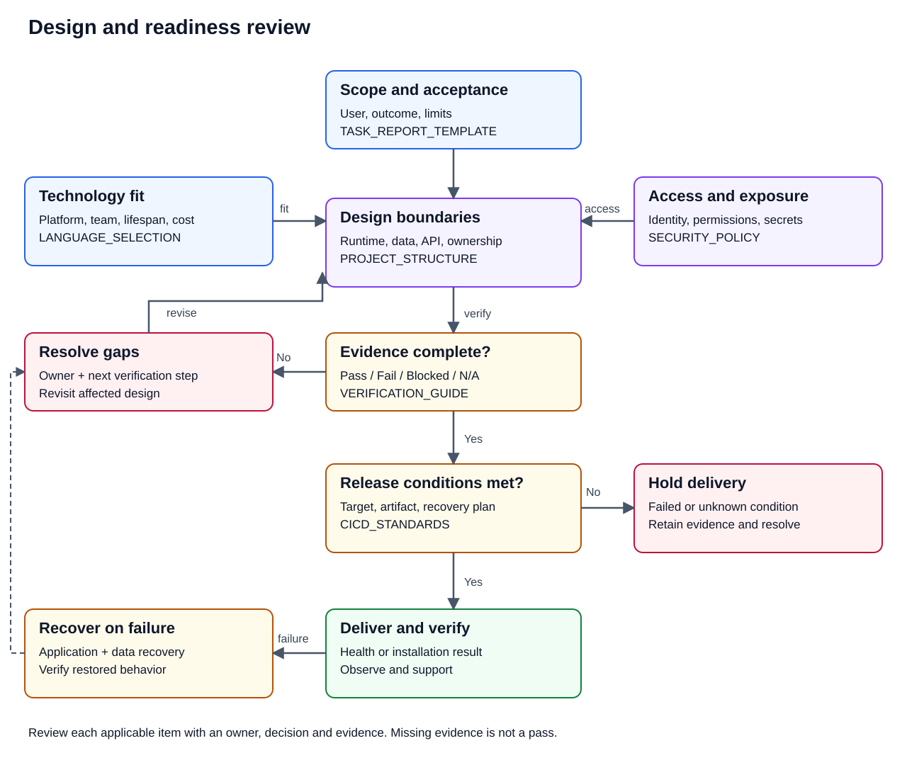

# End-to-end boilerplate usage manual

This is the human starting point for adopting Soku conventions. It connects the
supported decisions and commands without replacing their authoritative
contracts. Follow linked normative documents when an edge case needs more
detail.

## 0. Review the project before choosing configuration

For document-specific component and boundary diagrams, use the
[engineering convention index](../../README.md#engineering-conventions-at-a-glance).
The [editable FigJam board](https://www.figma.com/board/SJgcvEV1HZqYwHM5Nt5HWE)
contains the document authority, authorization and implemented CI maps.
GitHub's diagrams and text remain readable without a Figma account.

Start with the problem, execution environment and acceptance conditions. The
boilerplate supplies conventions and starter configuration; the downstream
project owns its application architecture, data model and deployment topology.
This review is an adoption aid, not a requirement to build every listed
component or to provision cloud infrastructure.



Read the image as a review loop: scope informs design; technology and security
constrain it; verification gaps return to design; delivery requires a recovery
plan; unhealthy delivery triggers recovery and another review. The text and
tables below remain usable without the image.

Use the [task report](../issues/TASK_REPORT_TEMPLATE.md) for a scoped change.
For a new system, link its project-owned design document from that report.
For each applicable item, record an owner, a decision, an evidence link and
one status: `Pass`, `Fail`, `Blocked` or `N/A`. A pass needs evidence;
N/A needs a reason and an owner. Unresolved applicable conditions block the
affected implementation or release; unrelated work can continue.

| Review | Question to answer | Evidence to record | Detailed source |
| --- | --- | --- | --- |
| R1 — Purpose and scope | Who uses it, what outcome changes, and what is excluded? | User scenario, boundaries, priorities and acceptance conditions | [Task report](../issues/TASK_REPORT_TEMPLATE.md) |
| R2 — Quality and constraints | What load, latency, OS/browser support, availability, recovery time and cost limits actually apply? | Measurable targets, assumptions and an owner for each unknown | [Language selection](./LANGUAGE_SELECTION.md) |
| R3 — Runtime and responsibilities | Where do UI, logic, storage and integrations run? Why are they separate or combined? | Runtime/data-flow diagram and component responsibilities | [Project structure](../standards/PROJECT_STRUCTURE.md#design-boundary-review) |
| R4 — Data and interfaces | Which records are authoritative? How are concurrency, migrations and failed/duplicate requests handled? | Data relationships, API contracts, change and failure rules | [Project structure](../standards/PROJECT_STRUCTURE.md#design-boundary-review) |
| R5 — Identity and exposure | Who can perform each action, and which connections or data are exposed? | Permission matrix, trust boundaries and secret handling | [Security policy](../policy/SECURITY_POLICY.md#application-access-review) |
| R6 — Network and naming | Are a server, DNS, TLS, ports, proxy or offline synchronization needed? | Connection inventory, owners, renewal and failure behavior; N/A where unused | [Project structure](../standards/PROJECT_STRUCTURE.md#design-boundary-review) |
| R7 — Acceptance and QA | How will normal, denied, failed and recovered behavior be checked? | Requirement-to-test mapping, results and user acceptance | [Verification guide](../../VERIFICATION_GUIDE.md#downstream-product-acceptance-review) |
| R8 — Delivery and operation | How will the artifact reach users, be observed, updated and recovered? | Release/install plan, health checks, rollback/restore evidence and support owner | [CI/CD standards](../standards/CICD_STANDARDS.md#delivery-readiness-review) |

Examples are illustrative, not universal targets. Replace "fast" with a
measured condition such as "95% of list requests complete within 2 seconds
at the agreed dataset and concurrency." Replace "safe" with an observable
condition such as "a user cannot read another team's record by changing
its identifier." Choose these values with the project's users and owners.

For a local desktop app, a public domain, cloud account or server may be N/A.
For a connected desktop app, review both local persistence and server
authorization. An existing system change can reuse current design evidence
and review only the affected boundaries; it still needs regression evidence.

The following documents answer different questions:

- [Language selection](./LANGUAGE_SELECTION.md): why this language/runtime fits.
- [Stack configs](./STACK_CONFIGS.md): which existing starter files to copy.
- [Applicability](./APPLICABILITY.md): which governance level fits the project.
- [Verification guide](../../VERIFICATION_GUIDE.md): how to verify this
  repository and separately plan product acceptance.
- [Cloud Run delivery](./CLOUD_RUN_CICD.md): the implemented optional GCP path,
  not the default architecture for every project.

## 1. Choose an adoption level and profile

Choose the smallest level that meets today's operating needs. A profile controls
which convention files `soku` manages; it is not a team-size entitlement.

| Adoption level | Recommended profile | Start here when |
| --- | --- | --- |
| Personal | `bootstrap` | One maintainer needs safe editor and ignore defaults with minimal governance. |
| Team | `standard` | Contributors share CI, templates, and review conventions. This is the default profile. |
| Scaled | `scaled` | Multiple teams or agents need the standard layer plus explicit ownership and agent policy. |

Profiles compose in order: `bootstrap`, `bootstrap → standard`, and
`bootstrap → standard → scaled`. Read
[Applicability](./APPLICABILITY.md) before discarding a control merely because a
project is personal. Security, licensing, predictable structure, and validation
still matter at every level.

Record these decisions before initialization:

- adoption level and profile;
- project name and selected stack IDs;
- collaboration language;
- whether task reports and cloud delivery are enabled;
- every intentional downstream override and its owner.

## 2. Obtain and verify the published baseline

The current pair is boilerplate `v1.0.5` and CLI `soku/v0.2.1`. These are
independent release axes. The verified lifecycle compatibility baseline remains
`soku/v0.1.4`; never infer compatibility from matching version numbers or
select `latest`.

### Verify the boilerplate source

The boilerplate release is a signed source tag, not a binary asset. `soku init`
accepts the exact `v1.0.5` tag, resolves it through GitHub to a full commit, and
validates the bounded source archive and catalog before planning writes. For a
manual source checkout, verify the tag before using it:

```bash
git clone https://github.com/Soku-JINSEOK/Soku-Convention-Boilerplate.git
cd Soku-Convention-Boilerplate
git fetch --tags
git verify-tag v1.0.5
git switch --detach v1.0.5
```

Do not move, recreate, or accept a locally substituted public tag. See
[Release and Sync](../standards/RELEASE_AND_SYNC.md) for tag authority and
compatibility records.

### Download and verify the CLI

Download the `soku/v0.2.1` archive matching the platform and
`checksums.txt` from the
[CLI release](https://github.com/Soku-JINSEOK/Soku-Convention-Boilerplate/releases/tag/soku/v0.2.1).
For Linux amd64:

```bash
curl -LO https://github.com/Soku-JINSEOK/Soku-Convention-Boilerplate/releases/download/soku/v0.2.1/checksums.txt
curl -LO https://github.com/Soku-JINSEOK/Soku-Convention-Boilerplate/releases/download/soku/v0.2.1/soku_v0.2.1_linux_amd64.tar.gz
grep ' soku_v0.2.1_linux_amd64.tar.gz$' checksums.txt | sha256sum --check -
tar -xzf soku_v0.2.1_linux_amd64.tar.gz
./soku --version
```

On macOS, select the `darwin_amd64` or `darwin_arm64` archive and replace the
checksum command with `shasum -a 256 --check`. On Windows, select
`soku_v0.1.4_windows_amd64.zip`, calculate
`Get-FileHash -Algorithm SHA256`, and compare it with that asset's exact line in
`checksums.txt` before extraction. Stop if the checksum or version differs.

For `soku/v0.2.0` and later, you can also install via npm:

```bash
npm install -g @soku-jinseok/soku@0.2.1
soku --version
```

The npm package resolves the same release archive from GitHub, validates its
`checksums.txt` entry, caches a local executable, and executes it.

## 3. Detect stacks and preview initialization

Run `soku` from the target repository root. Detection uses repository markers;
an explicit repeated `--stack` list replaces detection.

| Marker | Stack ID |
| --- | --- |
| `package.json` | `javascript-typescript-node` |
| `pyproject.toml` | `python` |
| `go.mod` | `go` |
| `pom.xml` | `java-spring` |
| `db/mysql/schema.sql` | `mysql` |
| `db/postgresql/schema.sql` | `postgresql` |
| `cloudbuild.yaml` | `gcp` |
| `buildspec.yml` | `aws` |
| `azure-pipelines.yml` | `azure` |

For an empty repository, choose at least one stack explicitly. Preview the
complete plan without writing files:

```bash
soku init \
  --boilerplate-source https://github.com/Soku-JINSEOK/Soku-Convention-Boilerplate \
  --boilerplate-release v1.0.5 \
  --profile standard \
  --stack javascript-typescript-node \
  --project-name example-service \
  --verify \
  --dry-run
```

Repeat `--stack` for a multi-stack repository. Add `--non-interactive --json`
when automation needs one machine-readable plan; dry-run still writes nothing.

## 4. Supply required stack inputs

Use real, durable names. Placeholder values become managed output and should not
be used as temporary guesses.

| Selection | Required input |
| --- | --- |
| JavaScript/TypeScript/Node or Python | `--project-name example-service` |
| Go | `--module-path github.com/example/example-service` |
| Java/Spring | `--java-group io.example --service-name example-service` |
| GCP | `--service-name example-service` |

`--project-name` is also useful as the stable project identity across stacks.
For a strict YAML alternative, use `--config <yaml-path>` and the schema shown in
the [`soku` CLI guide](../../soku/README.md). CLI flags override YAML, YAML
overrides manifest state, and detection is lower priority. Never put tokens,
credentials, raw provider configuration, or credential-bearing URLs in the
configuration.

## 5. Verify, resolve collisions, and apply

`--verify` runs built-in commands against the isolated staging tree. Review the
dry-run path list and verification result, then apply the same immutable inputs:

```bash
soku init \
  --boilerplate-source https://github.com/Soku-JINSEOK/Soku-Convention-Boilerplate \
  --boilerplate-release v1.0.5 \
  --profile standard \
  --stack javascript-typescript-node \
  --project-name example-service \
  --verify \
  --yes
```

Only `.gitignore` and `.editorconfig` have bounded merge strategies. Any other
existing selected output is project-owned and stops initialization with exit
`4` before managed state is written. When that happens:

1. keep the existing file and the dry-run output;
2. compare it with the intended template;
3. rename, remove, or deliberately integrate the conflict in a separate
   reviewed change;
4. rerun the complete dry-run; and
5. apply only when the plan has no unexplained collision.

Do not use `--yes` to bypass a conflict; it approves a validated plan, not an
unsafe overwrite.

## 6. Operate the lifecycle every day

A successful initialization writes `.soku/manifest.json` last. Commit that
portable record with the managed files. Do not edit its hashes or ownership
entries by hand.

```bash
soku status
soku diff --boilerplate-release v1.0.5
```

`status` is local and read-only. It returns `0` for clean state, `3` for pending
or drifted state, and `5` for an incompatible state. `diff` is also read-only;
exit `3` means a non-empty comparison, not an internal failure.

For an approved future release, use the exact version in all three steps:

```bash
soku diff --boilerplate-release vMAJOR.MINOR.PATCH
soku upgrade --boilerplate-release vMAJOR.MINOR.PATCH --dry-run
soku upgrade --boilerplate-release vMAJOR.MINOR.PATCH --yes
```

Review added, updated, removed, merged, locally modified, and conflict paths.
Never downgrade or replace the manifest's source with a branch or floating tag.
Profile changes use `diff --profile <id>` and
`upgrade --profile <id>` within the same transaction boundary.

## 7. Use the supported manual path when needed

If a project intentionally does not adopt automated lifecycle management, use
the [Initialization Guide](./INIT_GUIDE.md). It defines stack detection,
placeholder replacement, downstream CI selection, label synchronization, and
the reporting checklist.

For repeatable manual synchronization, work from a verified boilerplate tag and
preview before copying:

```bash
./scripts/sync-boilerplate.sh --target /path/to/downstream --dry-run
./scripts/sync-boilerplate.sh --target /path/to/downstream --force
```

PowerShell users use `scripts/sync-boilerplate.ps1 -TargetRoot <path> -WhatIf`
before `-Force`. The scripts copy only tracked convention-owned inputs and do
not distribute `soku/`. Follow [Release and Sync](../standards/RELEASE_AND_SYNC.md)
for ownership, pinning, and parity rules. Do not mix manual copying and
manifest ownership for the same path without an explicit migration plan.

## 8. Configure collaboration governance

Before opening work to contributors:

1. record the commit, Issue, and PR collaboration language in
   `CONTRIBUTING.md`;
2. retain the applicable Issue forms and complete PR template;
3. copy `.github/labels.yml` and run
   `scripts/sync-labels.sh --repo <owner>/<repo>`;
4. decide whether each non-trivial task requires an approved
   `docs/issues/issue-<n>-task-report.md`;
5. require type and area labels plus an accountable assignee on PRs; and
6. protect `main` with `Validation Gate` and `PR Metadata Gate` as required
   status checks; and
7. if the repository uses Project #2 synchronization, configure the
   `PROJECT_SYNC_TOKEN` secret and review the
   [Project synchronization guide](./GITHUB_PROJECT_SYNC.md).

The complete human contract, limited Dependabot exception, review expectations,
completion-label rules, and relation requirement live in
[GitHub Standards](../standards/GITHUB_STANDARDS.md). Keep branch protection and
review rules proportional to Personal, Team, or Scaled adoption, but never
weaken secret scanning or required validation to make a PR green.

## 9. Run local and hosted validation

Local checks give fast feedback and can exercise tools installed on the
developer machine:

```bash
scripts/verify.sh --profile full --workspace .
```

(`scripts/ci-local.sh` still works as a thin alias for the command above.)
Use `--skip-infra` only when the change has no infrastructure surface, and
`--skip-db` when Docker Compose isn't available for the local MySQL/PostgreSQL
schema checks. The [Verification Guide](../../VERIFICATION_GUIDE.md) and
[`verification/CLASSIFICATION.md`](../../verification/CLASSIFICATION.md) list
exact repository, template, security, and parity commands, and which of them
are `hosted-only`.

Hosted Validation is the authoritative clean-run evidence across GitHub-hosted
platforms. Push only after local checks pass, then inspect both aggregate gates.
If a hosted job fails:

1. record the current PR head SHA and inspect only checks attached to that SHA;
2. classify the result as `governance` (title, body, labels, assignee, or
   policy), `code/test` (a reproducible repository check), `external approval`
   (for example a fork-only `/gcbrun` gate), or `stale/cancelled` (a superseded
   SHA or concurrency cancellation);
3. for governance failures, correct the PR metadata and wait for the current
   metadata gate;
4. for code/test failures, open the first failed job, capture its exact command
   and error, reproduce the narrow command locally where possible, and push a
   focused correction;
5. for external approval, obtain the required trusted approval without exposing
   credentials or weakening the contributor boundary; and
6. ignore stale/cancelled results only after confirming a newer head SHA exists,
   then require the newest aggregate code and metadata gates.

Metadata-only edits intentionally skip full code validation while rechecking
current PR metadata. A prior successful code run does not excuse a failing
latest metadata gate.

## 10. Enable optional GCP dev delivery

GCP delivery is opt-in. Read the complete
[Cloud Run CI/CD and bootstrap guide](./CLOUD_RUN_CICD.md) before granting cloud
permissions.

1. Run `scripts/gcp-bootstrap.sh` without `--apply` to preview.
2. Review the exact project, region, service, repository, WIF, and runtime
   boundaries.
3. Apply only with `--apply --confirm-project-id <exact-project-id>`.
4. Run **Deploy to GCP (Cloud Run)** with `operation=check`.
5. Run `operation=deploy`, `environment=dev`.
6. Verify authenticated `/health`, the new ready revision at 100% traffic, and
   the `deploy-evidence-*` artifact with `final_status: success`.
7. For recovery, run `operation=rollback` with an exact revision when known, or
   follow the documented automatic/manual rollback procedure.

Tokens and generated credential paths must never appear in logs or evidence.
This baseline exposes only `dev`. Staging/prod environments, Terraform/IAM
expansion, and release/tag creation require separate review and authorization.

## 11. Override, upgrade, and recover safely

Treat managed paths as imported policy. Put a necessary downstream deviation in
a project-owned policy or ADR that names the rule, reason, owner, affected
paths, and re-evaluation date. Never disguise an override by editing a recorded
baseline hash.

Before every upgrade, commit or stash unrelated project work, run `status`, and
review `diff` plus the complete dry-run. A failed apply with successful rollback
exits `7`; verify the restored tree before retrying. Exit `8` means rollback was
incomplete: stop all mutation, preserve `.soku/` recovery evidence, and follow
the [Lifecycle Contract](../standards/SOKU_LIFECYCLE.md). If `status` reports
`recovery-required`, preserve both the manifest and pending file until an
explicit recovery path is reviewed.

Never:

- commit credentials, tokens, state secrets, or raw integration configuration;
- add executable hooks or scripts through a provider bundle;
- select a branch, abbreviated commit, floating version, or unverified archive;
- hand-edit `.soku/manifest.json` or delete ambiguous recovery evidence;
- overwrite project-owned collisions to force initialization or upgrade; or
- expand cloud delivery beyond the reviewed environment and identity boundary.

## 12. First-adoption completion checklist

- [ ] Adoption level and `bootstrap`, `standard`, or `scaled` profile recorded.
- [ ] Boilerplate `v1.0.5` and CLI `soku/v0.2.1` selected independently.
- [ ] For `soku/v0.2.0` and later, npm wrapper option is verified if used.
- [ ] CLI archive checksum and reported version verified.
- [ ] Stack IDs and required names confirmed with no placeholders.
- [ ] `soku init --verify --dry-run` reviewed with no unexplained collisions.
- [ ] Explicit `--yes` application succeeded and the manifest was committed.
- [ ] `soku status` reports clean state.
- [ ] Collaboration language, templates, labels, assignee policy, and task-report
  choice recorded.
- [ ] Local checks and hosted aggregate gates pass.
- [ ] Optional GCP `dev` health, 100% traffic, rollback path, and evidence were
  verified, or cloud delivery was explicitly left disabled.
- [ ] Overrides, owners, upgrade cadence, and recovery contacts are documented.

## Troubleshooting index

| Symptom | Start with |
| --- | --- |
| Stack or placeholder uncertainty | [Initialization Guide](./INIT_GUIDE.md) and [Stack Configs](./STACK_CONFIGS.md) |
| Profile, ownership, drift, exit code, or recovery issue | [Lifecycle Contract](../standards/SOKU_LIFECYCLE.md) |
| CLI installation, configuration, provider, or packaging detail | [`soku` CLI guide](../../soku/README.md) |
| Manual downstream synchronization | [Release and Sync](../standards/RELEASE_AND_SYNC.md) |
| Issue, PR, label, review, or Dependabot policy | [GitHub Standards](../standards/GITHUB_STANDARDS.md) |
| Project #2 synchronization, token setup, or conflict recovery | [GitHub Project and Metadata Sync](./GITHUB_PROJECT_SYNC.md) |
| Local versus hosted check failure | [Verification Guide](../../VERIFICATION_GUIDE.md) |
| Cloud Run bootstrap, deploy, evidence, or rollback | [Cloud Run CI/CD guide](./CLOUD_RUN_CICD.md) |
| Personal versus team applicability | [Applicability](./APPLICABILITY.md) |
