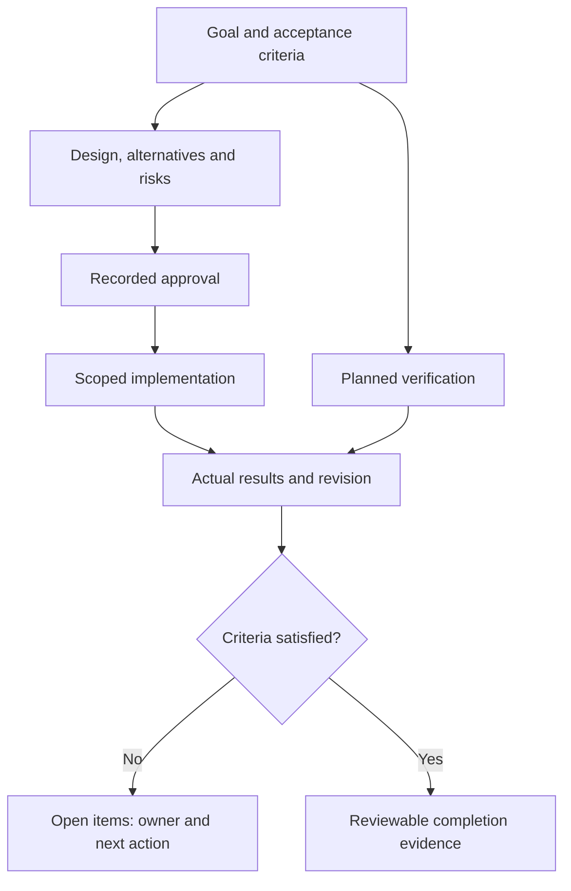

# 📝 Task Report Template

<!-- Copy this file to `docs/issues/issue-<n>-task-report.md`, where `<n>` matches the linked issue number. -->

## Evidence map

Use the diagram as a completeness check when filling this report. Link existing evidence instead of copying policy text.

## Goal and Background

<!-- What problem or request does this address? Link the issue. -->

## Proposed Approach

<!-- Describe the intended design or fix at a level a reviewer can approve before implementation starts. -->

## Planned Implementation

<!-- List the concrete steps or files expected to change. -->

## Acceptance Criteria

<!-- Define observable conditions that mean this task is done. -->

## Design and Risk Review

<!-- Review affected boundaries only. Link current design evidence rather than
copying policies. For a new system, link its project-owned design document.
See docs/guides/USAGE_MANUAL.md section 0 for the review map. -->

| Area | Decision or N/A reason | Owner | Evidence |
| --- | --- | --- | --- |
| User outcome, scope and measurable quality targets | | | |
| Runtime, data model, interfaces and concurrency | | | |
| Identity, resource permissions, network/DNS/TLS and secrets | | | |
| Verification, user acceptance, compatibility and accessibility | | | |
| Artifact, update/migration, recovery and operating cost/support | | | |

<!-- Record significant alternatives and tradeoffs. Each unresolved risk needs
an impact, owner and the next validation step. -->

## Verification and Delivery Plan

<!-- Plan requirement-to-check mapping and expected results before implementation.
Keep planned checks separate from the actual Verification section below.
Use Pass / Fail / Blocked / N/A with reason; missing evidence is not a pass.
Record release/install conditions, compatible app/data recovery and support.
This plan does not authorize deployment or release. -->

## Approval

<!-- Implementation should not start until this section records an explicit approval. -->

- **Status:** `Pending` / `Approved`
- **Approved by:** `<name or None>`

## Implementation Status

<!-- Update once work begins. Keep this section current as the task progresses. -->

## Verification

<!-- List only checks actually run and their results. -->

## Public Disclosure Review

<!-- Check before merge. A skipped or unchecked item is not a pass. -->

- [ ] No credentials, tokens, private keys, or credential-bearing URLs
- [ ] No private repository, project, or product names
- [ ] No cloud project IDs, account numbers, service URLs, image URIs, or
      revision identifiers
- [ ] No personal billing, subscription, budget, or payment-status information
- [ ] No personal email, phone, address, or local absolute path
- [ ] No private Issue, PR, Project, or control-plane identifiers

## AI Assistance

<!-- Replace with the actual tool used or `None`; do not leave placeholders. -->

- **Planning/implementation/drafting:** `<actual tool or None>`

---

<!-- 이 파일을 `docs/issues/issue-<n>-task-report.md`로 복사합니다. `<n>`은 연결된 이슈 번호와 일치해야 합니다. -->

## 목표 및 배경

<!-- 어떤 문제 또는 요청을 다루나요? 관련 이슈를 링크합니다. -->

## 제안하는 접근

<!-- 구현 착수 전 검토자가 승인할 수 있는 수준으로 설계 또는 수정 방향을 설명합니다. -->

## 계획된 구현

<!-- 변경될 것으로 예상되는 구체적인 단계나 파일을 나열합니다. -->

## 수용 기준

<!-- 이 작업이 완료되었다고 판단할 수 있는 관찰 가능한 조건을 정의합니다. -->

## 설계 및 위험 검토

<!-- 영향을 받는 경계만 검토하고 기존 설계의 근거를 링크합니다.
신규 시스템은 해당 프로젝트의 설계 문서를 연결합니다.
검토 순서는 docs/guides/USAGE_MANUAL.md의 0절을 참고합니다. -->

| 영역 | 결정 또는 해당 없음의 이유 | 담당자 | 근거 |
| --- | --- | --- | --- |
| 사용자 목표·범위·측정 가능한 품질 기준 | | | |
| 실행 위치·데이터 모델·인터페이스·동시성 | | | |
| 신원·데이터 권한·네트워크/DNS/TLS·비밀정보 | | | |
| 검증·사용자 검수·호환성·접근성 | | | |
| 배포물·업데이트/이전·복구·운영 비용/지원 | | | |

<!-- 주요 대안과 장단점을 기록합니다. 미해결 위험에는 영향,
담당자와 다음 확인 작업을 기록합니다. -->

## 검증 및 배포 계획

<!-- 구현 전에 요구사항별 확인 방법과 기대 결과를 계획합니다.
아래의 실제 검증 결과와 계획을 구분합니다.
Pass / Fail / Blocked / N/A를 사용하고 N/A의 이유를 기록합니다.
근거가 없는 항목은 통과가 아닙니다. 출시/설치 조건, 앱·데이터의
호환 가능한 복구와 지원 담당자를 기록합니다.
이 계획은 실제 배포나 릴리스를 승인하지 않습니다. -->

## 승인

<!-- 이 섹션에 명시적인 승인이 기록되기 전까지 구현을 시작하지 않습니다. -->

- **상태:** `Pending` / `Approved`
- **승인자:** `<이름 또는 None>`

## 구현 현황

<!-- 작업이 시작되면 갱신합니다. 진행 상황에 맞춰 최신 상태로 유지합니다. -->

## 검증

<!-- 실제 실행한 검사와 결과만 작성합니다. -->

## 공개 적합성 검토

<!-- 병합 전 확인합니다. 건너뛰거나 체크하지 않은 항목은 통과가 아닙니다. -->

- [ ] credential, token, private key, credential이 포함된 URL이 없음
- [ ] 비공개 저장소·프로젝트·제품 이름이 없음
- [ ] cloud project ID, 계정 번호, service URL, image URI, revision
      식별자가 없음
- [ ] 개인 청구·구독·budget·결제 상태 정보가 없음
- [ ] 개인 이메일·전화번호·주소·로컬 절대 경로가 없음
- [ ] 비공개 Issue·PR·Project·control-plane 식별자가 없음

## AI 지원

<!-- 실제 사용 도구로 교체하거나 `None`으로 표기합니다. 플레이스홀더를 그대로 남기지 않습니다. -->

- **계획/구현/초안 작성:** `<실제 사용 도구 또는 None>`
