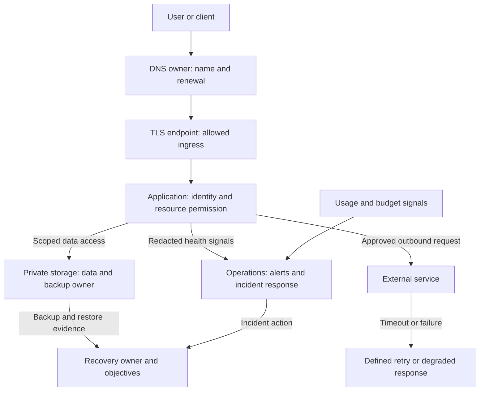

# ☁️ Cloud Policy

> **Document purpose:** Cloud decision policy. Defines provider and service selection through workload, identity, recovery and operating cost.
>
> **Key point:** Document who operates each resource and why its obligations are justified by the workload.

> **Applies to:** Team/Scaled — see [`docs/guides/APPLICABILITY.md`](../guides/APPLICABILITY.md). A personal project on a single cloud account only needs the workload-fit reasoning below, not the multi-account governance framing.

## Cloud responsibilities and exposure

This reference shows responsibilities to document when a connected service uses cloud resources. It is provider-neutral and does not assert that these resources are deployed by this repository. A local application can omit the cloud entirely.

**How to read:** This is a provider-neutral reference, not a claim of deployed resources. DNS maps the name, TLS protects transport, and application authorization controls resource access. Each layer has a different owner and failure mode.

**Reader check:** Who owns certificates, access, data restoration, external failures and budget alerts? Mark hosted components N/A for an offline app.

- [ ] Document ingress, egress, DNS/certificate renewal and environment-specific identities.
- [ ] Estimate storage, requests and network costs, and name the alert and recovery owner.
- [ ] Choose a single provider unless a concrete requirement justifies the additional operating burden.

## Why workload fit precedes provider choice

A provider or service adds account, identity, recovery and support obligations.
Start with the workload and the team's ability to operate it. Managed services
can reduce patching work but introduce service constraints, recurring cost and
exit effort. Self-managed infrastructure trades those constraints for maintenance
and incident responsibility. An offline application may need neither.

Record the rejected option, expected load, storage/egress assumptions, recovery
objectives, operator and budget review threshold. Validate with a representative
cost estimate and recovery exercise; a provider comparison table is not operating
evidence. Revisit when measured demand, residency requirements or operating
capability changes. Use the shared
[decision contract](../../CONTRIBUTING.md).

## 🎯 Purpose

This document defines how repositories based on `Soku-Convention-Boilerplate` should document and reason about cloud usage.

Cloud selection should be driven by workload fit, organizational capability, compliance needs, and operational maturity rather than branding preference.

## 📐 Core Principles

Cloud decisions should be:

- workload-aware
- cost-aware
- security-aware
- team-capability-aware
- explicit in tradeoffs

## 📋 General Rules

When a repository depends on cloud services, document:

- which provider is used
- which services are in scope
- why that provider was chosen
- what environments exist
- how credentials and permissions are managed

## 🤔 Provider Selection in Practice

### 🟦 GCP

Teams often choose `GCP` when they want a platform that feels especially strong in:

- data and analytics workloads
- managed Kubernetes operations
- modern developer workflows with relatively simple platform primitives
- services that integrate naturally with BigQuery, Cloud Run, GKE, or Vertex AI

In practice, `GCP` is frequently selected by teams that:

- operate data-heavy products
- want a strong serverless container story through Cloud Run
- prefer a cleaner entry path for smaller platform teams
- build internal tools or AI-enabled systems around Google Cloud data services

`GCP` is often attractive when the team values fast setup, tight integration across managed services, and lower operational overhead for modern web backends or analytics platforms.

### 🟧 AWS

Teams often choose `AWS` when they need:

- the broadest service catalog
- mature enterprise adoption patterns
- highly flexible infrastructure design
- strong multi-account operational models
- access to ecosystem depth across networking, security, storage, and compute

In practice, `AWS` is frequently selected by teams that:

- run at larger scale or across multiple business units
- require complex infrastructure customization
- need deep platform specialization options
- already operate inside an AWS-centered enterprise environment

`AWS` is often the practical choice when an organization needs breadth, granular control, and long-term architectural flexibility, even if that comes with more operational complexity.

### 🟦 Azure

Teams often choose `Azure` when they need strong alignment with:

- Microsoft enterprise ecosystems
- hybrid infrastructure strategies
- identity and access models centered on Microsoft Entra ID
- existing Windows, .NET, M365, or enterprise procurement standards

In practice, `Azure` is frequently selected by teams that:

- are part of enterprise IT organizations already standardized on Microsoft tooling
- need smoother hybrid connectivity between on-premise and cloud environments
- rely heavily on Active Directory-like identity patterns and Microsoft governance models
- build business systems closely integrated with the Microsoft stack

`Azure` is often the most realistic choice when organizational compatibility matters as much as raw technical features.

## 🧭 Selection Heuristic

If the team is choosing among major cloud providers, document the decision across these dimensions:

1. workload type
2. team familiarity
3. security and compliance requirements
4. cost model
5. operational complexity
6. vendor ecosystem fit

## 📋 Repository Expectations

If cloud-specific scripts, deployment files, or infrastructure code are committed, the repository should explain:

- what provider they target
- whether they are production-ready or starter examples
- what assumptions they make about accounts, regions, and permissions

## 🔀 Multi-Cloud Rule

Do not adopt multi-cloud by default for image or strategic reasons alone.  
If multi-cloud is used, the repository should explain the concrete business or resilience reason clearly.

## 🎬 Summary

Good cloud policy turns provider choice into an explicit engineering decision.  
The right provider is the one that best fits the workload, operating model, and organizational reality of the team.
