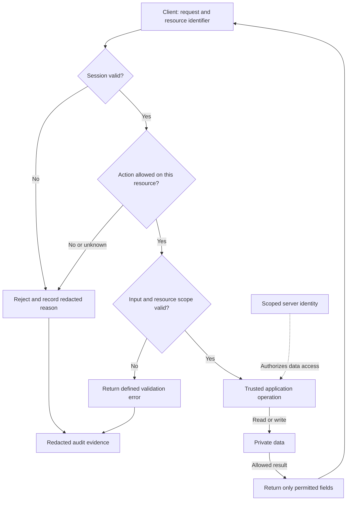

# 🔐 Security Policy

> **Document purpose:** Security operating policy. Defines secret hygiene, identity, resource authorization, dependency review and response responsibilities.
>
> **Key point:** Enforce permission at the trusted operation boundary and verify denial paths as well as allowed use.
>
> **Applies to:** Both (lighter for Personal) — see [`docs/guides/APPLICABILITY.md`](../guides/APPLICABILITY.md). Secret hygiene and dependency review matter solo too; only the "external reporter" framing in `SECURITY.md` assumes other users.

## Access enforcement and secret boundary

This is a connected-application reference. Authentication establishes identity; authorization checks the requested action against the specific resource. For an offline app, apply the relevant checks at the OS/file boundary and record hosted components as N/A.

**Diagram scope: Reference request-security model.** These are required design questions, not a supplied authentication service. Session, resource permission and input validation are separate checks. A downstream implementation must define denial, permitted response fields and audit redaction.

**How to read:** Identity answers who is asking; resource permission answers whether that user may perform this action on this particular record. A client cannot grant itself permission. Private credentials remain inside the trusted boundary.

**Reader check:** Test another user's record identifier, missing roles, invalid input and the fields returned to the client.

[Editable FigJam counterpart](https://www.figma.com/board/SJgcvEV1HZqYwHM5Nt5HWE)

- [ ] Test denied access as well as allowed access, including changing another user's resource identifier.
- [ ] Keep service credentials out of distributed clients and verify that logs omit sensitive payloads.

## Why identity and resource permission are separate

A valid session proves who is asking, but not whether that identity owns or may
modify the requested resource. A client-only visibility check can be bypassed
by a direct request. Enforce authorization at the trusted operation boundary,
including resource scope, and reject unknown permission states.

The accepted cost is explicit permission logic and denial-path tests. Keep
policy reuse consistent without assuming every resource has the same rule.
Evidence includes attempts with another user's identifier, expired sessions
and insufficient roles. Revisit the model when tenancy, sharing or privileged
operations change. Record project-specific choices under the shared
[decision contract](../../CONTRIBUTING.md).

## 🎯 Purpose

This document defines the baseline security posture for repositories based on `Soku-Convention-Boilerplate`.

Security should be treated as an operating concern from the beginning, not as a later compliance add-on.

## 📐 Security Principles

Repository security should prioritize:

- least privilege
- explicit access boundaries
- safe defaults
- traceability
- fast remediation

## ✅ Minimum Expectations

At minimum, repositories should:

- avoid committing secrets
- document sensitive configuration handling
- use environment-specific credentials
- keep dependencies reviewable
- define a response path for security issues

## 🔑 Secret Management

Secrets must not be stored directly in source control.

Use:

- environment variables
- cloud secret managers
- CI platform secret stores
- documented local development overrides that are excluded from version control

## 🚪 Access Control

Access to infrastructure, production systems, and deployment workflows should follow least-privilege principles.

Prefer:

- role-based access
- scoped service accounts
- short-lived credentials where possible
- auditable permission changes

## 📦 Dependency Hygiene

Dependencies should be reviewed with security and maintenance in mind.

Projects should aim to:

- avoid abandoned packages
- update vulnerable dependencies promptly
- keep transitive risk visible
- document exceptions when upgrades are delayed

## 📋 Logging and Sensitive Data

Logs should be useful for diagnosis without leaking secrets or regulated information.

Avoid logging:

- access tokens
- passwords
- connection strings
- private keys
- personal or regulated data unless explicitly required and protected

## 🔁 CI/CD Security

Pipelines should:

- protect secrets from untrusted contexts
- avoid over-privileged automation tokens
- separate validation from production deployment where appropriate
- keep deployment approval paths explicit

## Application access review

Secret hygiene does not establish a product's access policy. Record the
application's trust boundaries and actor/action permissions in its project-owned
design document. Use the [structure review](../standards/PROJECT_STRUCTURE.md#design-boundary-review)
to locate components and connections; use the
[product acceptance review](../../VERIFICATION_GUIDE.md#downstream-product-acceptance-review)
to verify enforcement.

- [ ] Identify human users, administrators, automation identities and external
  integrations; define login/session expiry and account removal where used.
- [ ] Specify which actor can read, create, change, delete and export each
  resource, including ownership, team or tenant boundaries.
- [ ] Enforce authorization at the service or trusted data boundary for every
  operation; hiding a UI control is not an authorization check.
- [ ] Validate untrusted inputs, identifiers and files, including supported
  formats, size limits and safe file/path handling.
- [ ] Record public/private entrypoints, required connection protection and
  the minimum privileges of each application identity.
- [ ] Keep shared service secrets out of browser bundles and installed
  clients; identify where credentials are stored, rotated and revoked.
- [ ] Protect sensitive local files and exports, define retention/deletion,
  and avoid sensitive payloads in diagnostic logs.
- [ ] Define rejected-access behavior, useful audit events and who receives
  and investigates a suspected incident.

Check applicable items only after linking the decision and verification result.
For an offline app with no accounts, hosted login can be N/A with a reason;
OS permissions, local data, input handling and package integrity still need
review. Distributed clients and local files can be modified by their users;
a server must not trust a client assertion of identity or permission.

## 📣 Reporting and Remediation

Repositories should define how security issues are handled, including:

- where to report them
- who reviews them
- how severity is assessed
- how remediation is tracked

## 🎬 Summary

A strong security policy does not require heavy ceremony.  
It requires consistent operational discipline, safe defaults, and clear responsibility boundaries.
