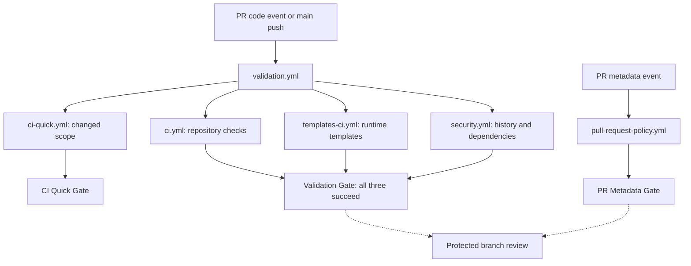
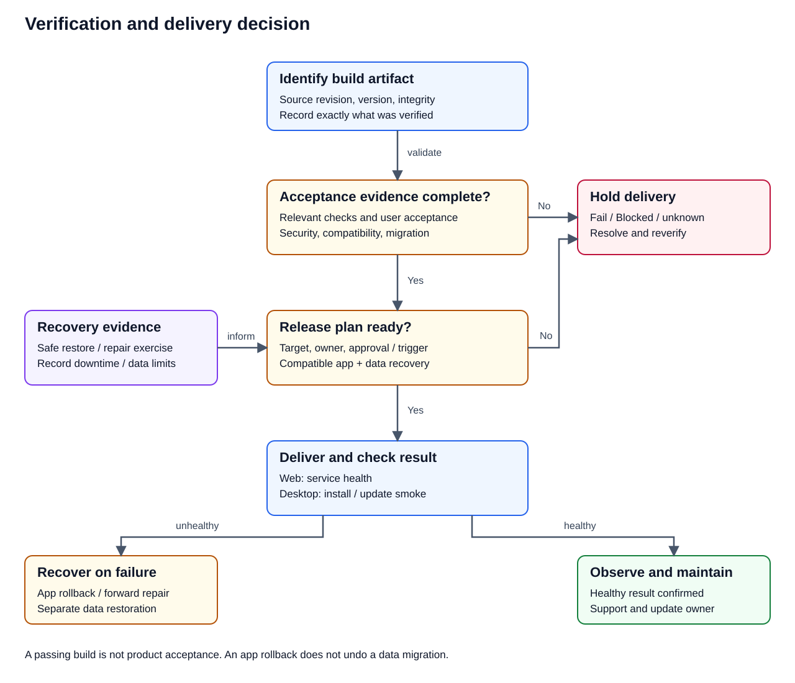

# 🔁 CI/CD Standards

## Implemented validation topology

The following is the actual workflow relationship in this repository. CI Quick provides feedback in parallel; the full Validation Gate aggregates repository, runtime-template and security results. PR metadata is checked separately. Passing validation does not itself deploy a product.

[Editable FigJam counterpart](https://www.figma.com/board/SJgcvEV1HZqYwHM5Nt5HWE)

- [ ] Inspect the newest run for the intended source revision; a cancelled earlier run is not a test result for its successor.
- [ ] Resolve the failing child job before rerunning the aggregate gate; keep audit thresholds and required checks intact.
- [ ] Batch PR body/title/label edits before starting final verification: edited events currently trigger Validation as well as metadata checks.

## 🎯 Purpose

This document defines the baseline expectations for continuous integration and continuous delivery in repositories built on `Soku-Convention-Boilerplate`.

CI/CD should support confidence, consistency, and safe iteration.  
It should not exist only as deployment automation, but as a quality enforcement layer.

## 🥅 Core Goals

CI/CD should help teams:

- catch regressions early
- enforce repository standards automatically
- keep delivery repeatable
- reduce manual release risk
- make validation visible

## 🔨 Continuous Integration Expectations

At minimum, CI should validate:

- formatting
- linting
- tests
- build or compile health

If relevant to the stack, CI may also validate:

- type checks
- security scanning
- dependency health
- migration safety
- package integrity

## 🚚 Continuous Delivery Expectations

CD should be designed so that deployment behavior is:

- predictable
- observable
- auditable
- reversible where possible

Deployment workflows should document:

- target environment
- trigger conditions
- required approvals
- rollback expectations

## 📐 Pipeline Design Principles

Pipelines should be:

- small enough to understand
- explicit in purpose
- separated by responsibility
- stable under repeated execution

Avoid building opaque pipelines that only one person can maintain.

For this boilerplate, Validation subscribes to PR opened, synchronize, reopened
and edited events, and pushes to main. It calls repository CI, runtime-template
validation and Security once each, alongside changed-scope Quick validation.
The same graph handles manual and reusable Validation calls. Pull Request
Policy and Project synchronization have separate event subscriptions.

Pull Request Policy authenticates current API metadata against the trusted
event identity. Project synchronization checks out the trusted base revision,
never executes PR head code, uses the scoped PROJECT_SYNC_TOKEN for Issue and
Project writes, and grants no Contents write permission. Its behavior is
documented in [GITHUB_PROJECT_SYNC.md](../guides/GITHUB_PROJECT_SYNC.md).

Repository CI and runtime-template workflows are manual or reusable, without
independent PR or main triggers. Security is reusable, manual and scheduled;
automatic PR security coverage comes through Validation. Draft/Ready changes
run metadata policy, not another code-validation tree. Closed PR events are
handled by Project synchronization for completion metadata.

Two operating-contract exceptions are intentional. Release may subscribe to
signed `v*` and `soku/v*` tag pushes, and Deploy remains manual through
`workflow_dispatch`. A tag event does not authorize another release axis, and a
manual deployment still requires its documented environment and operation
gates.

Keep default workflow permissions at `contents: read`; only the release
delivery job may request `contents: write`, after the shared validation and
signed release-record checks succeed. Pin every external action to a verified
full commit SHA and retain a nearby version comment so maintainers can audit
upgrades.

`verification/tools.env` and `verification/commands/*.sh` are the single
source of truth for the tool versions and thresholds these hosted workflows
and `scripts/verify.sh` profiles use for locally reproducible checks.
`--profile fast` uses the fail-closed changed-path mapping in
`verification/scopes.yml`; `--profile full` runs every locally reproducible
group. `--profile ci-quick --group <id> --base <sha> --head <sha>` is the
CI-only changed-scope entry point. A tested planner reads detector output and
the group, scope, and toolchain definitions in `verification/profiles.yml` to
create the dynamic matrix feeding the stable `CI Quick Gate` aggregate. The
required full gate remains unchanged during its comparison window.
Repository hooks use fast at pre-commit and full at pre-push, but hooks
and optional local reports remain bypassable developer feedback rather than a
security boundary. See
[`verification/CLASSIFICATION.md`](../../verification/CLASSIFICATION.md) for
the full local-capable/hosted-only/release-only/deployment-only breakdown.
This local tooling does not change `Validation Gate` or `PR Metadata Gate`
above.

`validation.yml` runs on code-bearing PR events and on `edited` events. An edit
reruns the full validation because it may change the target base. Labels,
assignment, and Draft/Ready changes are handled by the separate PR policy
workflow; they do not start another Validation run. This keeps the required
`Validation Gate` registered on the current PR head without allowing a
metadata-only result to satisfy it.

`full-validation.yml` adds an independent Hosted Full path without removing the
existing per-PR Full gate. It runs repository, runtime-template, and security
workflows against one exact head SHA; Security receives a separately selected
trusted base SHA for policy inputs. Results aggregate into `Hosted Full Gate`,
which fails closed on failure, cancellation, or an unexpected result. It
supports reusable calls, manual runs, and a daily `02:41 UTC` schedule. Required
contexts remain unchanged until Issue #116 passes every observation criterion
and the ruleset transition is recorded.

Soku-managed downstream repositories receive three responsibility-separated
workflows: pull-request/main quick validation, scheduled/manual full
validation, and weekly/manual security validation. Catalog v1 accepts both the
released `v1.0.5` three-shared-file shape with its single CI workflow and the
current five-shared-file shape with three workflow outputs. This additive
compatibility does not change the catalog, profile-index, or manifest major
versions.

## Why these CI choices

The [shared decision contract](../../CONTRIBUTING.md) also applies to CI changes.
Reduce duplicate execution before reducing evidence. The implemented choices
and remaining tradeoffs are explicit:

| Choice | Why this option | Alternative and accepted cost | Evidence and revisit condition |
| --- | --- | --- | --- |
| One full tree per manual Validation | Its direct repository, template and security calls already provide full coverage | Removed the additional Hosted Full call; standalone Hosted Full still has its own gate and entrypoints | Regression counts each component once; revisit if Hosted Full gains a distinct responsibility |
| Preserve required full checks and Quick comparison | A cheaper Quick result has not yet satisfied the full-gate transition criteria | Keep overlap during the Issue #116 observation window rather than silently weakening coverage | Review measured comparison evidence before any ruleset transition |
| Retain PR edited events | Editing the base can change what must be validated | Body/title edits still incur a full run; batch edits before final verification | Revisit only with tested base-retarget handling and protection against metadata results replacing code results |
| Cache runner npm downloads by lockfile | Repeated installs can reuse downloaded packages | Cache storage and misses remain; npm ci, integrity checks, typecheck and unit tests always run | Compare cold/warm install steps; remove cache if sustained overhead exceeds the benefit |
| Use explicit hygiene Go cache inputs | There is no root go.mod, so default discovery cannot restore the cache | Key by the module sum, tool pins and owning workflow; cold misses still install tools | The initial hosted log reported a missing dependency file; verify the warning disappears and review warm-cache benefit |
| Keep independent scheduled/manual Hosted Full | Rechecks unchanged code against evolving dependencies and tools | Scheduled execution has a separate ongoing cost | Review frequency using failure yield and measured runner work |

### Measure work and coverage together

Baseline [run 36807006720](https://github.com/Soku-JINSEOK/Soku-Convention-Boilerplate/actions/runs/36807006720)
had 24 full component jobs totaling 760 job-seconds, excluding Quick, gates and
queue time. This is the sum of job start/end intervals, not elapsed pipeline
time or a billing amount. It is one observation, not a stable benchmark.

Manual Validation previously invoked those three full components twice.
Removing the nested call changes two full trees to one: 50% fewer full-component
invocations on that entrypoint, plus removal of its nested aggregate job.
The 760 seconds illustrate the size of one tree; they are not a measured
before/after saving. PR runs did not invoke that manual-only tree, so this
change does not claim a 50% reduction for PRs. Cache savings remain unmeasured.

For future optimization, compare the same revision and event, distinguish cold
and warm caches, and record job count, summed runner work, elapsed time, retry
rate and coverage. Preserve failures and cancellations in the history. The owner
reviews the [Issue #245 report](../issues/issue-245-task-report.md) and the
existing Quick observation criteria before narrowing additional checks.

## 🌍 Environment Strategy

Projects should define environment expectations clearly, such as:

- local
- development
- staging
- production

Differences between environments should be intentional and documented.

## 🔑 Secrets and Credentials

Do not hardcode secrets into the repository.  
Use the platform's secret management features and keep credential flow explicit in deployment documentation.

## 🚨 Failure Policy

Pipelines should fail loudly and informatively.  
A failing step should make it clear:

- what failed
- why it likely failed
- what area is affected

The aggregate gate must fail when any required component fails, is cancelled,
or does not run unexpectedly. A deliberate skip may be accepted only when the
event makes the check inapplicable, such as contribution-title validation on a
direct post-merge `main` push or a release preflight.

## ✅ Minimum Recommended CI Stages

1. checkout
2. dependency installation
3. formatter and linter validation
4. unit or integration tests
5. build or packaging validation

## ✅ Minimum Recommended CD Stages

1. artifact preparation
2. deployment approval if required
3. deployment execution
4. health verification
5. rollback or remediation path

## Delivery readiness review

Use this table when a downstream project deploys a service or distributes an
application. These are review inputs, not claims that this boilerplate already
implements every delivery mechanism. Product acceptance evidence is defined in
the [verification guide](../../VERIFICATION_GUIDE.md#downstream-product-acceptance-review);
the implemented optional GCP path remains in
[Cloud Run CI/CD](../guides/CLOUD_RUN_CICD.md).

The decision is: identify the artifact, complete applicable verification, confirm
release conditions, deliver and check the result. Failed or unknown conditions
hold delivery. A failed outcome invokes the documented recovery path.
Continuous delivery keeps a verified change releasable; continuous deployment
also automates its production delivery. Choose and document which applies.

| Review | Service/web delivery | Desktop/local delivery |
| --- | --- | --- |
| Artifact identity | Source revision and immutable package/image identity | Version, OS/CPU package and integrity identity |
| Configuration | Environment-specific settings and scoped identities | Installation paths, OS permissions and user settings |
| Acceptance | Relevant tests and target-environment smoke checks | Relevant tests plus clean install and supported-device smoke |
| Data change | Migration compatibility, transaction/backfill and backup plan | Existing local data, settings and version migration |
| Rollout | Target, approval/trigger, traffic/change strategy and health | Distribution channel, update policy and old-client support |
| Recovery | Compatible application rollback and separate data recovery | Reinstall/update recovery and compatible local-data restoration |
| Operation | Error/latency signals, alerts, support owner and cost | Crash diagnostics with consent/privacy, support and update owner |

- [ ] Record artifact identity and exactly which artifact was verified.
- [ ] Name the release owner, target and applicable approval/trigger.
- [ ] Confirm acceptance evidence and unresolved conditions before delivery.
- [ ] Review application/data compatibility across both upgrade and recovery.
- [ ] Verify the chosen health or installation smoke check after delivery.
- [ ] Verify recovery in a safe environment and record its limits.
- [ ] Define observation, support and retirement/data export responsibilities.

A previous application version does not automatically undo a database or file
migration. If rollback is unsafe, document a compatible forward repair or
restore procedure and its downtime/data-loss limits before release. Mark unused
mechanisms N/A with a reason; do not introduce servers or cloud delivery into an
offline app merely to complete this checklist.

## 📝 Documentation Rule

If a repository uses CI/CD, its README or `docs/` folder should explain:

- how validation runs
- what must pass before merge
- how deployments are triggered
- who owns deployment decisions

Document the local equivalents, hosted-only checks, audit evidence, and failure
handling in [VERIFICATION_GUIDE.md](../../VERIFICATION_GUIDE.md). For public
repositories, standard hosted runners are free, but larger runners remain
billable. Audit artifacts, caches, Packages, Git LFS, Codespaces, Marketplace
apps, and external services independently of runner minutes; do not treat a
successful or free compute run as proof that storage or account-wide cost is
zero.

## 🎬 Summary

CI/CD should turn repository standards into repeatable system behavior.  
The best pipeline is one that contributors can trust, understand, and maintain without hidden ceremony.
