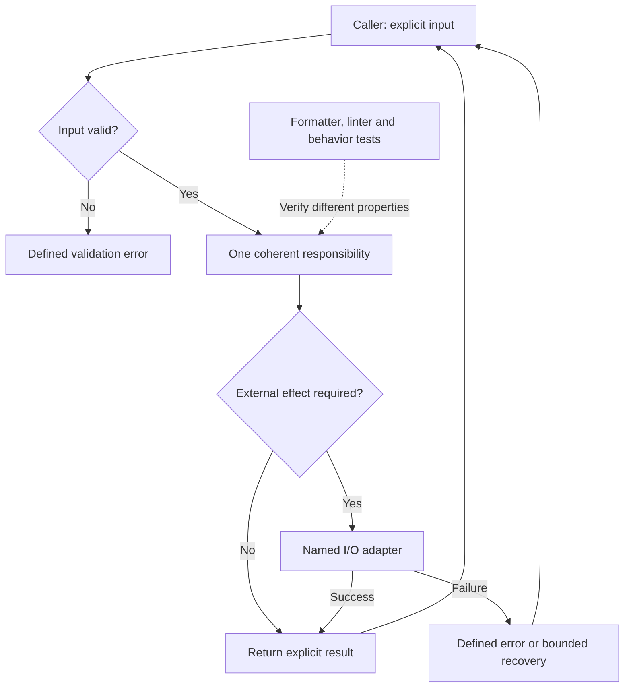

# 🎨 Code Style

> **Document purpose:** Code quality standard. Defines readable modules, explicit inputs and effects, naming, formatting and behavior checks.
>
> **Key point:** Make responsibilities and errors understandable without requiring readers to infer hidden behavior.

## Readable module contract

This example makes the existing rules about coherent functions, explicit inputs and predictable effects visible. It describes responsibilities, not mandatory classes or a framework.

**Diagram scope: Reference module contract.** The named I/O adapter illustrates a testable boundary; it is not a required class hierarchy or a claim that all modules already use it. Formatters cannot prove business correctness.

**How to read:** Solid arrows show runtime control and results; the dotted arrow is verification. Keep I/O visible so callers and tests can distinguish a business result from a dependency failure.

**Reader check:** Can a reader name the inputs, result, failure behavior and side effects without opening every dependency?

- [ ] Can the function's inputs, outputs, errors and side effects be identified from its interface?
- [ ] Can a reviewer focus on behavior while the configured formatter and linter enforce style?

## 🎯 Purpose

This document defines the operational style expectations for repositories built on `Soku-Convention-Boilerplate`.

The goal is not to create stylistic rigidity for its own sake.  
The goal is to reduce ambiguity, improve readability, and make automated enforcement practical across different projects and stacks.

## 📏 Baseline

The default baseline is `Google Style Guide`.

When a language-specific formatter or linter is adopted, it should either:

- align directly with Google-style conventions, or
- document any intentional differences explicitly

### 🌐 Per-Language Google Alignment

The starter templates under `templates/` adopt Google's own official tooling and values wherever one exists, rather than a hand-tuned approximation:

| Language | Google guide | Formatter | Linter | Indent | Line length |
| --- | --- | --- | --- | --- | --- |
| TypeScript / JavaScript | [Google TypeScript Style Guide](https://google.github.io/styleguide/tsguide.html) | [`gts`](https://github.com/google/gts) (wraps Prettier) | `gts` (wraps ESLint) | 2 spaces | 80 |
| Python | [Google Python Style Guide](https://google.github.io/styleguide/pyguide.html) | [`Black`](https://black.readthedocs.io/) | `ruff` (lint only) | 4 spaces | 80 |
| Java / Spring | [Google Java Style Guide](https://google.github.io/styleguide/javaguide.html) | [`google-java-format`](https://github.com/google/google-java-format) | Checkstyle `google_checks.xml` | 2 spaces (+4 continuation) | 100 |
| Go | [Effective Go](https://go.dev/doc/effective_go) | `gofmt` / `goimports` | `golangci-lint` | tabs | (`gofmt`-determined) |

Notes:

- TS/JS: `gts` sets Prettier to `singleQuote: true`, `bracketSpacing: false`, `arrowParens: "avoid"`, `trailingComma: "all"` — see `templates/javascript-typescript-node/prettier.config.cjs` and `eslint.config.mjs`.
- Python: `ruff` handles linting only; formatting is delegated to Black with an
  explicit 80-column limit and Python 3.11 target — see
  `templates/python/pyproject.toml`.
- Java: Checkstyle's `configLocation` points at the `google_checks.xml` ruleset bundled with `maven-checkstyle-plugin`, not a hand-written ruleset — see `templates/java-spring/pom.xml`.
- Go's defaults already match Google's Go conventions; only `.editorconfig`'s `[*.go]` tab rule was needed to avoid conflicting with `gofmt`.

If a downstream project cannot use the official tool (e.g., organizational tooling constraints), document the substitute and the reason in that project's own style notes.

## 🏆 Style Priorities

When making style decisions, use this order of priority:

1. readability
2. consistency
3. explicitness
4. maintainability
5. brevity

Shorter code is not better if it becomes harder to read or review.

## 🏷️ Naming

Names should be descriptive enough to explain intent without requiring extra interpretation.

Prefer:

- clear domain language
- predictable file and directory names
- stable naming patterns across similar modules

Avoid:

- unnecessary abbreviations
- vague utility-style names
- inconsistent naming for equivalent concepts

## 🗂️ File and Module Design

Files should have a clear responsibility.  
If a file starts serving multiple unrelated concerns, split it before the structure becomes hard to reason about.

Modules should be organized to help contributors quickly infer:

- purpose
- boundaries
- dependencies
- expected extension points

## 🔧 Functions and Methods

Functions should do one coherent job and expose clear inputs and outputs.

Prefer:

- explicit parameters
- predictable return behavior
- guard clauses when they reduce nesting
- extracted helpers when they improve comprehension

Avoid:

- hidden side effects
- mixed levels of abstraction in the same function
- overly compact logic that obscures intent

## 💬 Comments

Comments should explain:

- intent
- constraints
- tradeoffs
- non-obvious behavior

Comments should not narrate obvious syntax or restate the code line by line.

## 🖋️ Formatting

Formatting must be delegated to tooling whenever possible.  
Do not use manual formatting preferences as a source of code review friction.

Typical enforcement areas include:

- indentation
- line length
- import ordering
- spacing
- quote rules
- trailing commas where applicable

## 🔍 Linting

Lint rules should reinforce correctness and maintainability, not just aesthetics.  
If a lint rule creates repeated low-value noise, the rule should be reevaluated rather than ignored silently.

## 📝 Documentation in Code

Public APIs, shared abstractions, and non-obvious modules should include enough context for future contributors to understand:

- what the code is for
- what assumptions it depends on
- how it should be extended safely

## 🧪 Testing Relationship

Code style and testing are related.  
Readable code is easier to test, and well-structured tests reinforce readable design.

Prefer tests that are:

- easy to scan
- behavior-oriented
- explicit about setup and expectations

## ⚠️ Exception Policy

Not every repository needs identical tooling, but every deviation from the baseline should be intentional and documented.

If a project diverges from the default style, document:

- what changed
- why it changed
- where the new rule applies

## 🎬 Summary

Code style in this boilerplate exists to support reliable collaboration.  
The standard should help humans read faster, help reviewers focus on substance, and help AI agents operate with less ambiguity.
