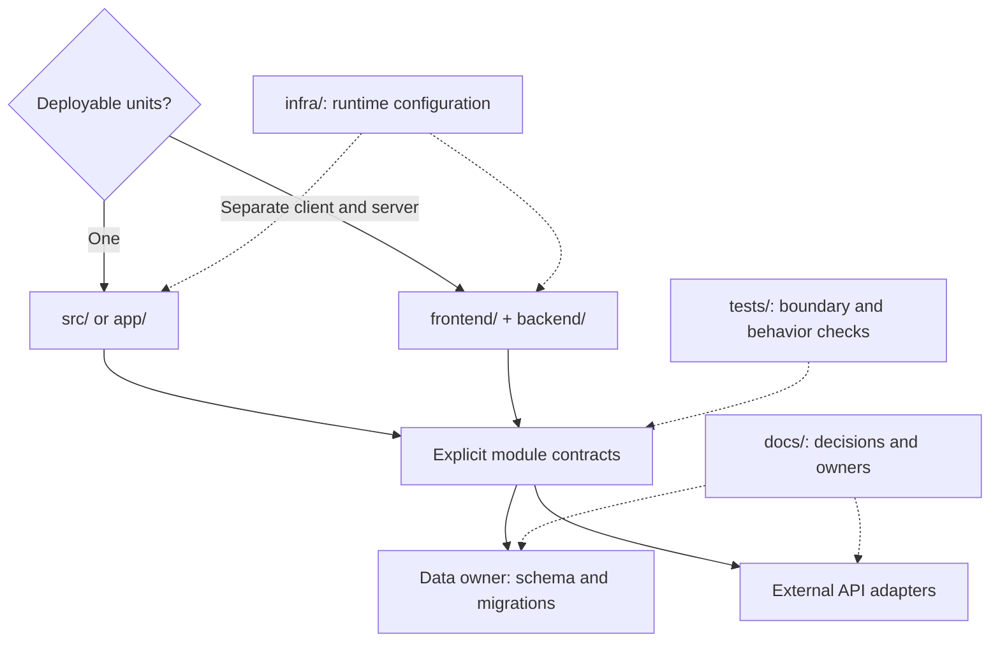
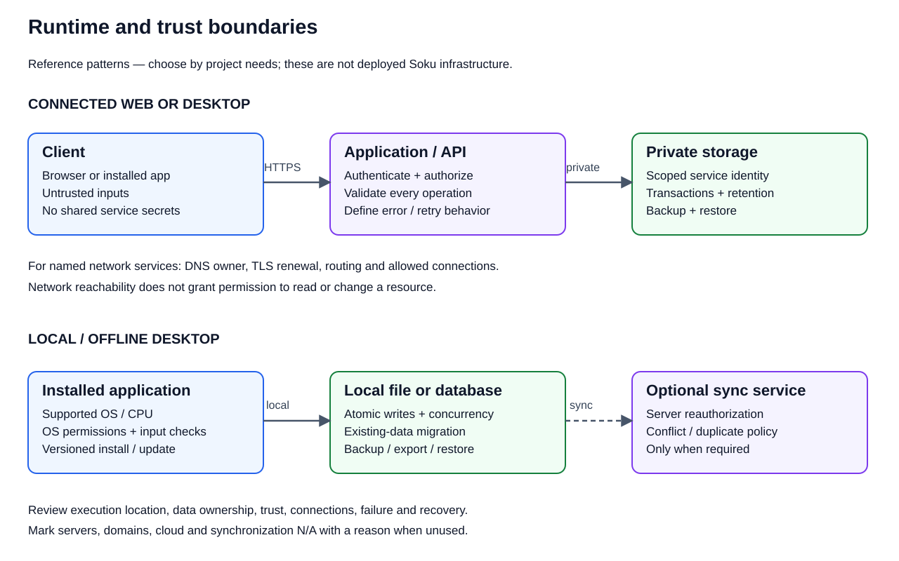

# 🏗️ Project Structure

## Ownership and dependency map

Choose a file layout that matches the actual deployable units. This reference separates contracts and data ownership from folder names; it does not require separate services.



- [ ] Choose app/ or frontend/ + backend/ in the multi-domain layout; do not duplicate the same responsibility in both.
- [ ] Identify the single writer or coordination policy for shared data, and test interface failures.

## 🎯 Purpose

This document defines how repositories based on `Soku-Convention-Boilerplate` should organize directories, files, and ownership boundaries.

The goal is not to force every project into an identical shape.  
The goal is to make repository structure predictable enough that contributors can move across projects without re-learning the layout every time.

## 📐 Structural Principles

Repository structure should optimize for:

- discoverability
- consistency
- separation of concerns
- low onboarding friction
- scalability over time

## ✅ Default Expectations

Projects should aim for the following qualities:

1. top-level directories should have clear and stable roles
2. application code and operational files should not be mixed carelessly
3. documentation should be easy to locate from the repository root
4. naming should be explicit and unsurprising
5. project-specific deviations should be documented

## 🗂️ Suggested Root Layout

```text
/
|-- .gitignore          # Shared ignore rules for common build artifacts
|-- .editorconfig       # Shared editor formatting baseline
|-- src/                 # Main application or package source code
|-- test/ or tests/      # Automated tests
|-- docs/                # Extended project documentation, grouped by category
|-- scripts/             # Operational and maintenance scripts
|-- config/              # Shared configuration files when appropriate
|-- templates/           # Copyable starter configs by stack
|-- infra/               # Infrastructure or deployment-related assets
|-- .github/             # GitHub workflows, templates, and repo automation
|-- README.md            # Public project overview
|-- BLUEPRINT.md         # Canonical repository design and authority map
|-- CONTRIBUTING.md      # Contribution workflow
|-- AGENTS.md            # AI agent operating instructions
```

This boilerplate applies the `docs/` grouping concretely as `docs/policy/`, `docs/standards/`, `docs/guides/`, and `docs/issues/` — see the [README.md](../../README.md) document index. Keep only true first-entry documents (`README.md`, `CONTRIBUTING.md`, `AGENTS.md`, `LICENSE`, `SECURITY.md`, and a top-level design document such as `BLUEPRINT.md`) at the repository root; move narrower policy, standards, and reference documents into the matching `docs/` subfolder instead of leaving them flat at the root.

## 📋 Directory Rules

### 💻 `src/`

Use `src/` for primary application logic unless the language ecosystem strongly prefers another conventional layout.

### 🧪 `tests/` or `test/`

Tests should be separated clearly from runtime code unless the ecosystem convention strongly prefers colocated tests.

### 📚 `docs/`

Use `docs/` for deeper documentation that should not overload the root.  
Examples include architecture notes, ADRs, onboarding guides, runbooks, and integration references.

### ⚙️ `scripts/`

Use `scripts/` for operational helpers that support local development, validation, migration, or deployment.

### ☁️ `infra/`

Use `infra/` for deployment, provisioning, environment, or platform-related definitions when those assets are part of the repository.

### 🧰 `templates/`

Use `templates/` for copyable starter configuration sets that downstream repositories can lift and adapt.  
This is the right place for language, framework, database, and cloud bootstrap files that should stay close to the boilerplate.

### 🐙 `.github/`

Use `.github/` for automation and collaboration standards such as:

- issue templates
- pull request templates
- CI workflows
- CODEOWNERS
- repository metadata

## 🌐 Multi-Domain Layout (Alternative)

The layout above assumes a single service/package. Some repositories are easier to navigate when domains are visible directly at the root instead of being buried under `src/`:

```text
/
|-- frontend/            # Web client (only if frontend/backend are split)
|-- backend/             # API/server (only if frontend/backend are split)
|-- app/                 # Single monolithic app (use instead of frontend/+backend/, never alongside)
|-- db/                  # Schema, migrations, seed data
|-- infra/               # IaC, deployment, environment definitions
|-- docs/                # Same docs/ convention as the single-service layout
|-- .github/
|-- README.md / CONTRIBUTING.md / AGENTS.md / ...
```

**Exclusivity rule:** a repository picks either `app/` (single monolithic app) **or** `frontend/` + `backend/` (split deployables) — never both. `db/` is where `templates/mysql` / `templates/postgresql` content lands; `infra/` is where `templates/aws` / `templates/azure` / `templates/gcloud` content lands.

**When to use this instead of the single-service layout:** see [Applicability](../guides/APPLICABILITY.md) — as a rule of thumb, a solo project or a single deployable unit is well served by the default `src/` layout; a project where frontend and backend actually deploy separately, or where multiple contributors (including parallel AI agents, see [AGENTS.md § Parallel Agent Ownership](../../AGENTS.md#parallel-agent-ownership)) need to work on distinct domains at once, benefits from domain folders being visible at the root.

This choice is orthogonal to the `Google Style Guide` baseline in [`CODE_STYLE.md`](./CODE_STYLE.md) — that document governs in-file code style, not directory topology, so either layout can adopt it unchanged.

## Design boundary review

A directory layout describes ownership of files. It does not prove that an
application's runtime or data boundaries are correct. Before selecting a
layout, record the following in the downstream project's design document,
linked from its [task report](../issues/TASK_REPORT_TEMPLATE.md).
The [usage manual review](../guides/USAGE_MANUAL.md#0-review-the-project-before-choosing-configuration)
connects these decisions to security, verification and delivery.



These are reference patterns, not a mandatory topology or a diagram of deployed
Soku infrastructure. A browser or connected desktop client calls an application
service that checks permissions before private storage access. A local desktop
application may instead use local files or a database, with synchronization
only when required. The server must reauthorize synchronized operations.

| Boundary | Decision to record | Completion evidence |
| --- | --- | --- |
| Runtime | Browser, OS process, server, job or external service; supported OS/CPU/browser versions | Component inventory with execution location, responsibility and owner |
| User flow | Input, loading, empty, success and error behavior; keyboard/accessibility needs where applicable | Screen/action flow with acceptance conditions |
| Data | Authoritative source, identifiers, relationships, uniqueness, retention, deletion and export | Data model and examples covering lifecycle rules |
| Consistency | Transaction boundaries, simultaneous edits, atomic local writes and duplicate operations | Conflict/transaction policy and relevant test scenarios |
| Interfaces | Request/response schema, version compatibility, error codes, pagination and limits | API or local interface contract, including failure behavior |
| Connections | Source/destination, protocol, port, authentication, timeout and retry policy | Connection inventory and exposure/trust boundaries |
| Naming and TLS | Domain/DNS ownership, routing and certificate renewal where used | Name-to-service mapping and renewal/support owner |
| Change and recovery | Existing-data migration, older-client compatibility, backup/restore and update failure | Migration/recovery procedure and planned verification |

Keep network reachability and application authorization separate. Do not put
service credentials in distributed clients, and do not expose a database merely
to simplify client access. A deliberate specialized client-to-data architecture
needs equivalent identity, authorization and evidence, documented as a
project-specific decision.

For each item, name an owner and link evidence. Mark an unused component N/A
with a reason instead of adding it to satisfy the table. Follow
[security policy](../policy/SECURITY_POLICY.md#application-access-review) for
permission review and [verification](../../VERIFICATION_GUIDE.md#downstream-product-acceptance-review)
for acceptance evidence.

## 📍 Documentation Placement

Place documents according to their scope:

- root: policies and high-visibility standards
- `docs/`: detailed reference material
- inline code comments: non-obvious local intent

Do not bury essential governance documents deep inside the tree.

## 🏷️ Naming Rules

Prefer names that are:

- descriptive
- stable
- short without becoming vague

Avoid names that require tribal knowledge, such as generic folders with unclear scope.

## 🔀 Deviation Policy

Not every project needs the exact same structure.  
If a repository adopts a different layout because of framework conventions or operational constraints, document the reasoning in the relevant onboarding or architecture material.

## 🎬 Summary

Good project structure makes the repository legible before anyone reads the code.  
A contributor should be able to open the root directory and understand where things belong with minimal guesswork.
