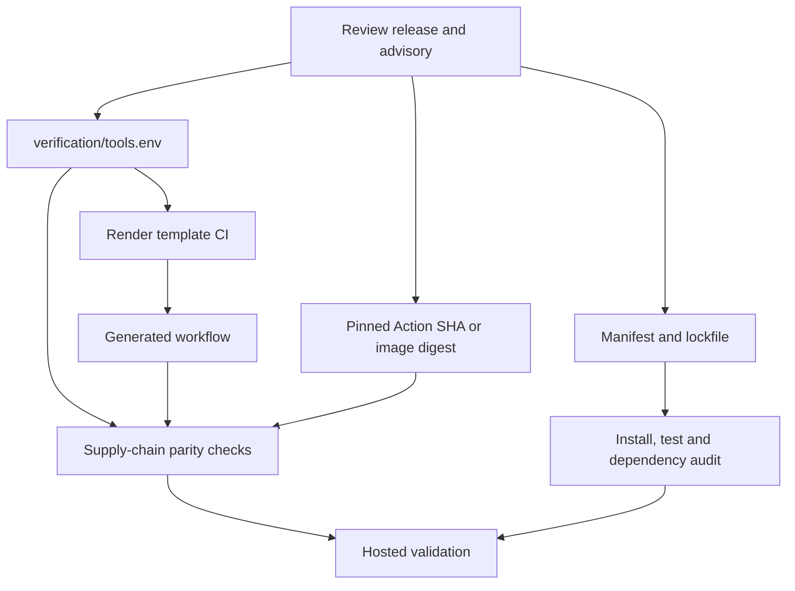

# Supply-Chain Input Standard

## Reviewed input and generated output map

Each artifact has one authoritative input. Generated copies must agree with it, and ecosystem checks must run after a dependency update.



- [ ] Update the authoritative manifest and lockfile together, retaining reviewed integrity values.
- [ ] Regenerate owned outputs and check parity rather than editing generated copies independently.
- [ ] Patch vulnerable versions and rerun installation/tests/audits without relaxing the gate.

## Purpose

Protected verification, release, and template paths must resolve reviewed
dependency, tool, Action, and container-image versions. Runtime resolution of
an unreviewed moving reference is not allowed.

## Authoritative Inputs

| Input | Authority | Enforcement |
| --- | --- | --- |
| Local verification tools and audit thresholds | `verification/tools.env` | Supply-chain parity verifier |
| GitHub Actions | Full commit SHA in workflow YAML | Immutable-reference verifier |
| MySQL and PostgreSQL verification images | `verification/tools.env` | Digest and parity verifier |
| Template base images | Template Dockerfile | Digest verifier |
| Language dependencies | Ecosystem lock or manifest files | Dependabot and hosted audits |
| Generated downstream CI | `templates/_shared/ci/downstream-ci-{quick,security}.yml`, `templates/_shared/ci/downstream-ci.yml`, and the Soku catalog | Catalog/rendering regression checks |
| Boilerplate template CI | `.github/workflows/templates-ci.template.yml` | Renderer parity check |

GitHub Actions resolves service images before workflow steps can source
`verification/tools.env`. The template workflow therefore repeats the reviewed
MySQL and PostgreSQL values. `scripts/verify-supply-chain.mjs` rejects drift
between those copies.

## Update Coverage

Dependabot must cover these tracked locations:

| Ecosystem | Locations |
| --- | --- |
| GitHub Actions | `/` |
| Go modules | `/soku`, `/templates/go` |
| npm | `/soku/npm`, `/soku/internal/manual/assets/runner`, `/templates/javascript-typescript-node` |
| Python | `/templates/python` |
| Maven | `/templates/java-spring` |
| Docker | `/`, `/.devcontainer`, `/templates/gcloud` |
| Terraform | `/infra/gcp`, `/infra/gcp/cloud-build-logging` |

The verifier treats a missing entry as a regression.

## Reviewed Update Procedure

1. Start from an automated update PR when coverage exists. For manual tool or
   image updates, record the upstream release and advisory context in the PR.
2. Update the authoritative manifest, lockfile, or `verification/tools.env`
   value. Do not update a generated workflow directly.
3. For an image, select an exact readable tag and resolve its official
   multi-architecture manifest digest. Update every verifier-required copy in
   the same change.
4. For a GitHub Action, retain the readable release comment and replace the
   reference with the reviewed full commit SHA.
5. Regenerate `.github/workflows/templates-ci.yml` with
   `go run scripts/render-templates-ci.go --write` when either canonical input
   changes.
6. Run:

   ```bash
   node --test scripts/verify-supply-chain.test.mjs
   node scripts/verify-supply-chain.mjs
   go run scripts/render-templates-ci.go --check
   ```

7. Run the affected ecosystem checks and require hosted validation before
   merging.

Major dependency changes remain individually reviewable. This procedure does
not change release delivery, required checks, or branch protection.
