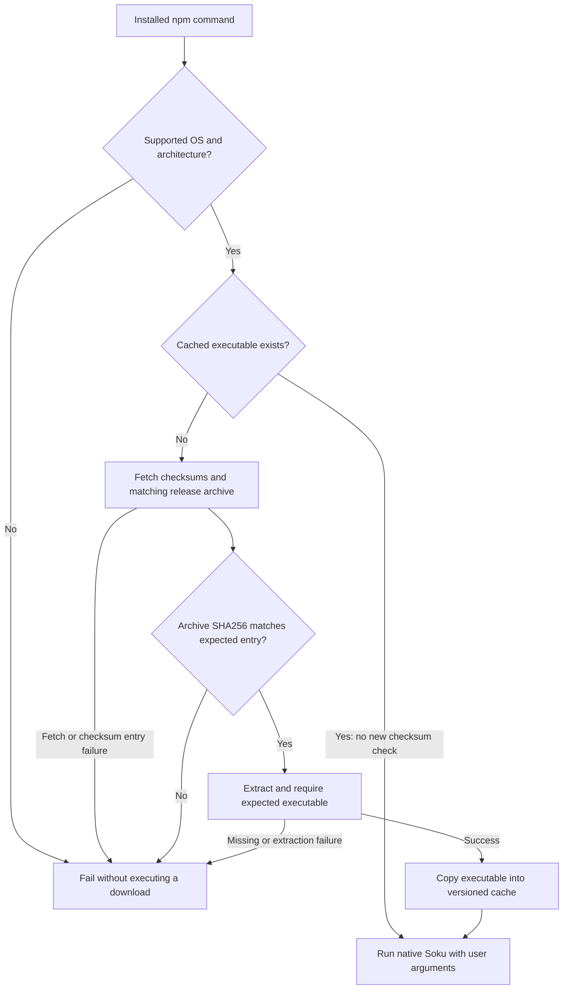

# `@soku-jinseok/soku`

> **Document purpose:** Package installation guide. Explains the npm launcher that downloads, verifies and runs the matching native Soku executable.
>
> **Key point:** Match package and release identity; downloaded archives are checked, but existing cached executables are reused without revalidation.

## Launcher execution



**How to read:** This is the implemented behavior in
[launcher.mjs](./lib/launcher.mjs), especially `resolveBinary`. The checksum
covers a newly downloaded archive. A cache hit checks file existence and
returns that path without hashing it again. The check does not independently
authenticate the checksum publisher.

**Why this distinction:** Download integrity and trust in an existing local
cache are different boundaries. Protect the user cache; do not describe this
launcher as detecting later cache tampering.

**Reader check:** Does the launcher select the expected platform asset and reject a mismatched download?

Cross-platform launcher for the native `soku` CLI distributed from
[`Soku-Convention-Boilerplate`](https://github.com/Soku-JINSEOK/Soku-Convention-Boilerplate).

This package is the npm installation path for `soku/v0.2.0` and later. The package
downloads the matching GitHub release asset at first run, verifies it with
`checksums.txt`, caches the native executable, and executes it with your provided
arguments.

## Install

```bash
npm install -g @soku-jinseok/soku@0.2.1
```

## Usage

```bash
soku --version
soku init --boilerplate-source https://github.com/Soku-JINSEOK/Soku-Convention-Boilerplate --help
```

The launcher accepts optional overrides for validation environments:

```bash
SOKU_GITHUB_REPOSITORY="owner/repo" soku --version
SOKU_LAUNCHER=1 soku status
```

## Verification

- Release assets are verified through the `checksums.txt` entry that matches the
  platform-specific archive in the target tag.
- Unsupported OS/arch combinations fail quickly with a clear message.
- Cache is stored under:

  - macOS/Linux: `~/.cache/soku/Soku-JINSEOK_Soku-Convention-Boilerplate/soku/vX.Y.Z/<os>/<arch>/`
  - Windows: `%USERPROFILE%\.cache\soku\...`

No external runtime dependency is required beyond a supported Node.js runtime.

## License

The npm launcher is licensed under the [MIT License](./LICENSE), matching the
repository-level license. Native CLI release archives retain their own bundled
third-party notices.
